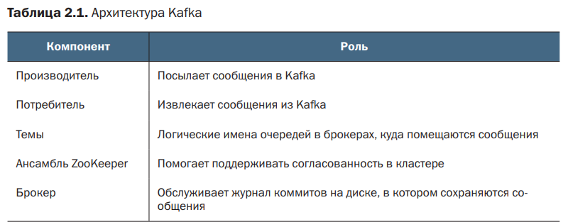

# Apache Kafka

**Apache Kafka** - это платформа потоковой передачи, которую можно использовать для большого количества
событий. Причем производитель может отправить любое сообщение, даже не имея ни малейшего предстваления
о том, ожидает ли эти сообщения хоть кто-нибудь.

Kafka может использоваться не только в качестве **шины сообщений**, но и может при этом **обрабатывать данные
в реальном времени**.

Раньше микросервисы взаимодействовали друг с другом посредством API, таких как REST,
но все чаще приложения строятся на том, что асинхронные **микросервисы обмениваются
событиями с помощью Kafka**.

> Kafka позволяет отделить друг от друга приложения, которые в старых проектах часто оказывались связанными
Ее можно вставить в середину рабочего процесса, и она будет служить единым интерфейсом к данным вместо
многочисленных API и баз данных.

### Уникальные возможности Kafka

- возможность повторной передачи сообщений по умолчанию;
- параллельная обработка данных;
- возможность читать одно сообщение неограниченное количество раз;
- возможность быстро обрабатывать большое количество сообщений за счет кеширования.

## Сообщения
### Доставка сообщений

**Сообщение** или же **запись** - это основная часть данных, проходящих через
Kafka. Собщения содержат значение, отметку времени, и **необязательный** ключ, при желании
можно добавлять свои заголовки. Сгенерированные сообщения передаются брокером.

Доставка сообщений в kafka может осуществляться несколькими способами
- **не менее одного раза (at-least-once)** - сообщение отправляется
потребителям до тех пор, пока они не подтвердят его получение.

- **не более одного раза (at-most-once)** - сообщение отправляется только
один раз и в случае сбоя н отправляется повторно. 
Пример использования: веб-сервис, отслеживающий количество просмотров страниц. В таком случае
не критично потерять пару сообщений из миллионов.

- **точно один раз (exactly-once)** - потребитель гарантированно получит
сообщение ровно один раз.

## Брокер

**Брокеры** - это сервера, которые отвечают за сохранение и управление данными, которые поступают в топики.
**Топики** - это категории (темы), в которые данные могут быть опубликованы.
Брокеры обрабатывают топки, сохраняя и управляя данными в них.

## Топики (темы)

Топик состоит из одной или нескольких **партиций** (разделов), которые размещаются на брокерах
(партиции разбиваются на **файлы сегментов**, которые записываются на диск).

Каждая партиция имеет несколько **реплик**, и внутри этих реплик одна из них является **лидером (ведущей)**,
а остальные **подписчиками лидера**. 

> Производители и потребители взаимодействуют только с лидером, от них
он получает обновления (от производителей) / запросы на чтение (от потребителей)  и передает
их подписчикам в своей группе реплик в реальном времени. Если реплика-лидер становится недоступной, одна
из реплик-подписчиков автоматическм выбирается в новую реплику-лидера.

Каждая реплика хранится **на отдельном брокере**, партиция хранится **на отдельном брокере**.
Таким образом партиция и 2 ее реплики суммарно будут хранится на 3 отдельных брокерах.

## Zookeper

Кластер Kafka включает несколько брокеров (серверов), чтобы брокеры действовали как одно согласованное приложение,
они должны не только общаться друг с другом но и достигать **согласия**. 

> Для обеспечения соединения между брокерами, их согласованности и координации их работы используется Zookeeper.

Zookeeper играет роль узла для хранения метаданных кластера и управления состоянием брокеров.

## Высокоуровневая архитектура Kafka

Кафка способна быстро обрабатывать миллионы сообщений. Одна из ключевых особенностей Kafka - **использование
кеша страниц операционной системы**. **Избегая кеширования в куче JVM**, брокеры могут предотвратить некоторые
проблемы, свойственные большим кучам, например, длительные или частые паузы на сборку мусора.

**Схема доступа к данным**: благодаря обслуживанию из кеша страниц, а не с диска, сообщения **обрабатываются быстрее**.
Когда поступают новые сообщения, высока вероятность, что пришедшие последними представляют больший интерес для
потребителей, и, соответственно, предпочтительнее обслуживать их **быстрее (из кеша)**.

## Журнал коммитов

**Журнал коммитов (фиксаций)** - место, куда последовательно добавляются сообщения. Пользователи журнала
(потребители) используют **смещения (offsets)**, чтобы знать, где они находятся в этом журнале и какое сообщение
они должны считать следующим для обработки. 

Этот механизм смещений позволяет потребителям **читать данные в своем 
собственном темпе** и **восстанавливать свое положение в случае сбоев или перезапусков**. 

> Особенность журанала коммитов: доступность только для добавления, т.е. события **всегда добавляются в конец**
журнала.

**Отличие кафка от других брокеров сообщений** - чтение сообщения не удаляет его из системы и не исключает
из других источников. Фактически, **одно сообщение можно читать неограниченное число раз**.

Хранением данных в журнале можно управлять по размеру или возврасту сообщениЙ с помощью свойств конфигурации.

## Потоковая обработка данных

Производители отправляют данные в Kafka, которая для надежности и масштабируемости действует как
распределенная система и использует журналы как основные хранилища.

Как только данные попадут в экосистему Kafka, потребители смогут помочь пользователям получить их в других
приложениях и сценариях использования. 

Брокеры объединятся в кластер и координируют свои действия при помощи Zookeeper.

Поскольку Kafka хранит данные на диске, осуществляется поддержка воспроизведения сообщений в случае сбоя приложений.

# Kafka Connect

**Kafka Connect** - фреймворк, позволяющий экспортировать данные из хранилища, например, базы данных в Kafka.

**Коннекторы-источники** преобразовыввают данные в сообщения Kafka (например, таблицы MySQL в темы Kafka).

**Коннекторы-приемники** используются для импорта данных из Kafka в другие системы. Например, переместить сообщения из
какой-то темы в долговременное хранилище можо с помощью коннектора-приемника, который будет излекать сообщения из темы
и записывать их, к примеру, в облачное хранилище.

# Безопасность

## SSL

SSL - Secure Socket Layer - протокол шифрования сообщений. При шифровании посторонние пользователи могут видеть
трафик, но не смогут понять его содержимое.

Для настройки шифрования сетевого трафика между кластерами необходимы ключ и сертифкат для брокеров.

keystore.jks - имя хранилища ключей, куда должен быть помещен сгнерированный ключ (ключ играет роль идентификации
для брокеров).

truststore.jks - хранилище доверенных сертификатов (подтверждают, что ключ подлинный)

## Kerberos и Simple Authentication and Security Layer

JAAS - Java Authentication and Authorization Service - сервис аутентификации и авторизации.

Файлы JAAS с информацией о файле keytab помогают передать в Kafka принципала (уикальное имя учетной записи)
и учетные данные. keytab - файл, содержащий принципала и зашифровнные ключи, он используется для аутентификации
брокеров Kafka без запроса пароля. 