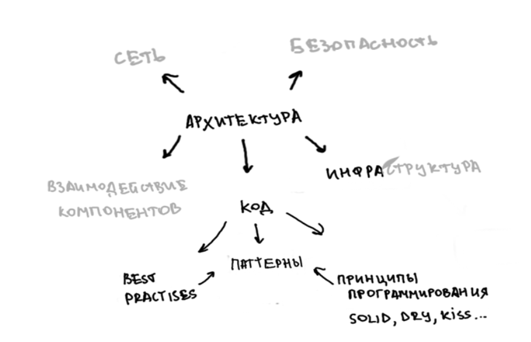
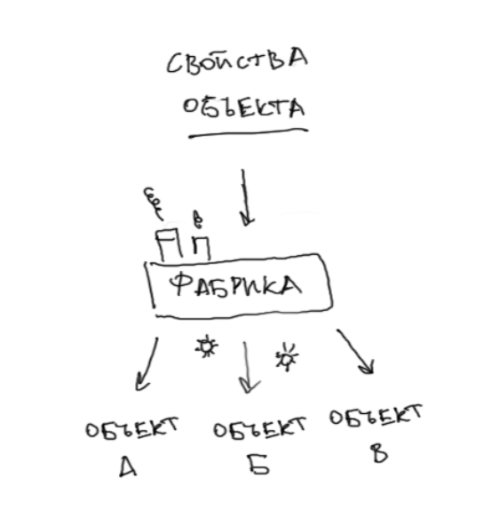
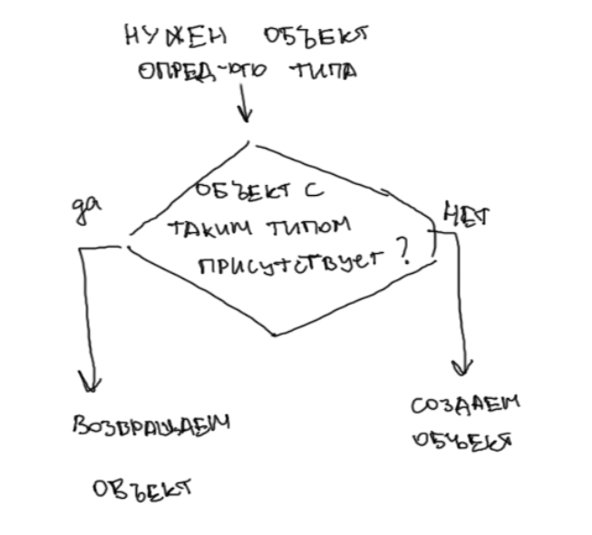
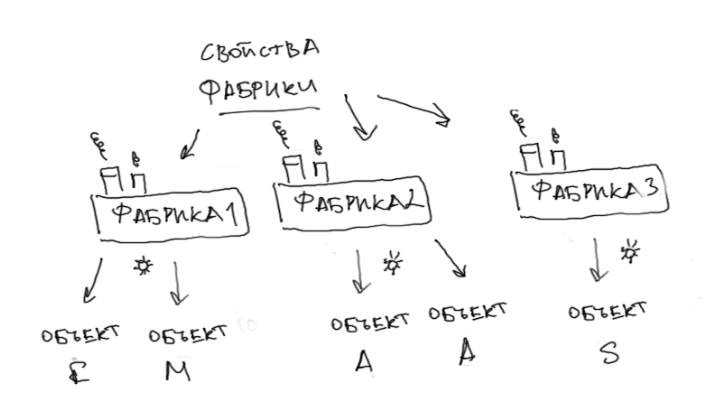
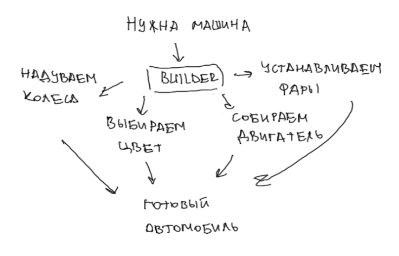
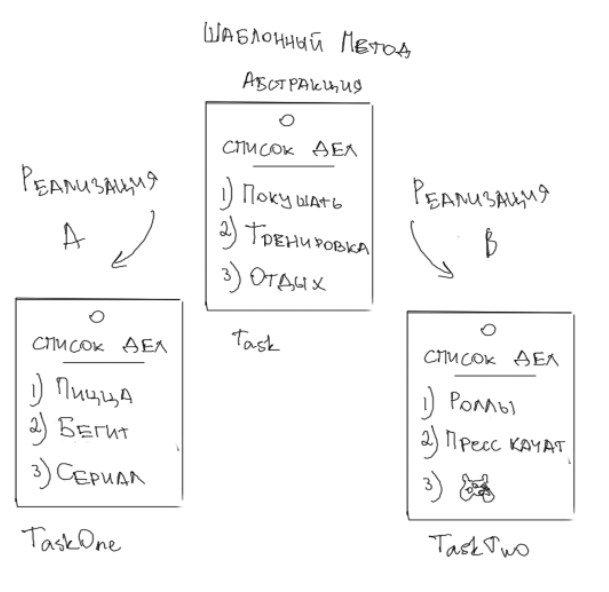
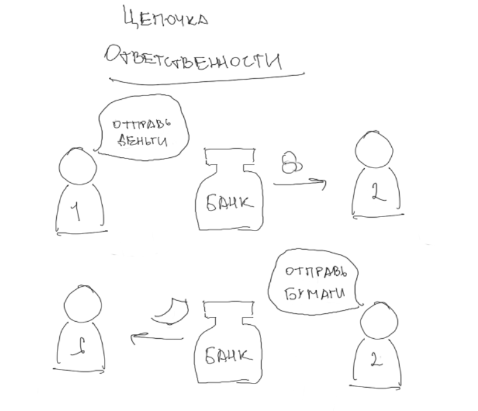
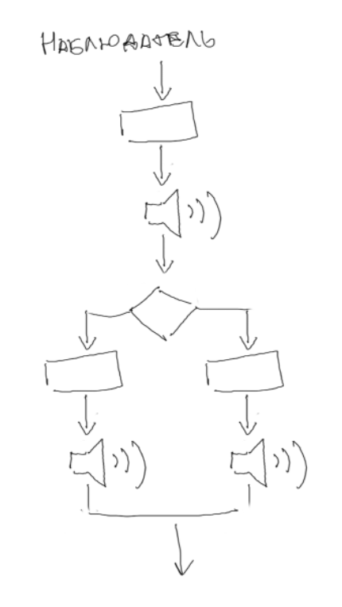
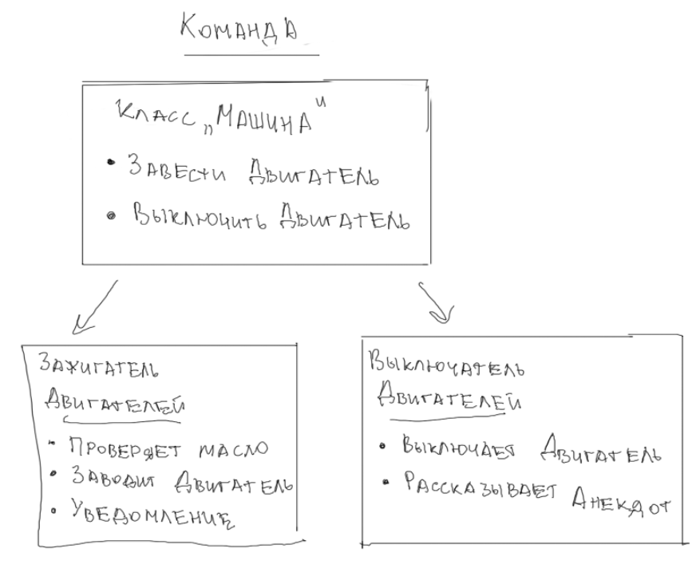

План:
1. Архитектура кода как часть архитектуры приложения
2. Что такое шаблоны проектирования приложения (паттерны)? 
3. Зачем нужны шаблоны проектирования?
3. Виды шаблонов проектирования
- Порождающие
- Поведенчиские
- Структурные
4. Антипаттерны

---

> Приветствие. С чего начинается разработка приложения? (Веду к проектированию архитектуры приложения) 

# Способы организации кода кода | Архитектура приложения

> Что такое архитектура приложения? Можно ли отнести код к архитектуре приложения?

**Архитектура приложения** - крупная система, включающая компоненты кода, различные слои приложения и их взамодействия.



# Шаблоны проектирования | Design Patterns

> Предположим, вам нужно решить задачу, у вас есть какие-то требования
> с чего начнете разработку?
> 
> 
> Смысл в том, что при разрешении какого-либо вопроса в разработке скорее всего, до вас с этим уже кто-то сталкивался,
> причем не один раз и уже какие-то рецепты решения проблемы. Так что, вместо того, чтобы изобретать свой велосипед лучше
> попробовать воспользоваться уже разработанными шаблонами проектирования

**Шаблоны проектирования** - это проверенные и готовые к использованию решения регулярно возникающих в повседневном программировании задач.
Используются для ускорения проектирования и последующей разработки приложений.

## Виды паттернов

Выделяют три типа паттернов:
- **Порождающие** - представляют собой механизмы инициализации, позволяют создавать объекты удобным способом.
- **Структурные** - определяют отношения между классами и объектами, позволяя им работать совместно.
- **Поведенческие** - упрощают взаимодействие между сущностями.


# Порождающие

**Порождающие шаблоны проектирования** используются для управления процессом создания объектов, делая систему независимой от
способа создания, композиции и представления объектов.


Они обеспечивают гибкость при решении вопросов о том,
что создается, кто это создает, как и когда.

Эти шаблоны позволяют инкапсулировать процесс создания объектов,
скрывая детали реализации и обеспечивая возможность выбора между различными способами создания объектов.

## Примеры порождающих паттернов

> Лайф-коддинг сессия, каждый паттерн

### **Фабричный метод | Simple Factory (Factory Method)**
Простой в реализации порождающий паттерн, который инкапсулирует процесс создания объектов с помощью отдельного класса-фабрики.

**Используется**, когда у нас есть суперкласс с несколькими подклассами и на основе ввода, нам нужно вернуть один из подкласса.
Класс не знает какого типа объект он должен создать. Объекты создаются "на лету" в зависимости от входящих данных.



```java
class Factory {
    public OS getCurrentOS(String inputos) {
        OS os = null;
        if (inputos.equals("windows")) {
            os = new windowsOS();
        } else if (inputos.equals("linux")) {
            os = new linuxOS();
        } else if (inputos.equals("mac")) {
            os = new macOS();
        }
        return os;
    }
}
interface OS {
    void getOS();
}
class windowsOS implements OS {
    public void getOS () {
        System.out.println("применить для виндовс");
    }
}
class linuxOS implements OS {
    public void getOS () {
        System.out.println("применить для линукс");
    }
}
class macOS implements OS {
    public void getOS () {
        System.out.println("применить для мак");
    }
}

public class FactoryTest {//тест
    public static void main(String[] args){
        String win = "linux";
        Factory factory = new Factory();
        OS os = factory.getCurrentOS(win);
        os.getOS();
    }
}
```

### Singleton | Одиночка

**Singleton**: Одиночка - паттерн, который гарантирует, что в системе существует только один экземпляр класса и предоставляет глобальную точку доступа к этому экземпляру.

 

### Abstract Factory | Абстрактная фабрика

**Abstract Factory**: Абстрактная фабрика - паттерн, предоставляющий интерфейс для создания семейств взаимосвязанных
или взаимозависимых объектов, без указания их конкретных классов.

Позволяет выбрать конкретную реализацию фабрики из семейства возможных фабрик. Создает семейство связанных объектов. Легко расширять.




### Builder | Строитель

**Builder**: Строитель - паттерн, который позволяет создавать разные виды объектов с использованием одного и того же процесса построения.

Используется для создания сложного объекта с использованием простых объектов.
Постепенно он создает больший объект от малого и простого объекта. Позволяет изменять внутреннее представление конечного
продукта.



# Поведенческие
 
### Шаблонный метод | Template Method

Позволяет определить основу алгоритма и позволяющий подклассам переопределять определенные шаги алгоритма, не изменяя его структуру в целом.


eeeeeeeeeeeeeeeeeeeeeeeeeeeeeeeeeee

### Chain of Responsibility | Цепочка обязанностей

Позволяет избежать жесткой зависимости отправителя запроса от его получателя, при этом запрос может быть обработан несколькими объектами.



## Observer | Наблюдатель
Позволяет одним объектам наблюдать за действиями что происходят в других объектах.




## Command | Команда

Позволяет инкапсулировать различные операции в отдельные объекты.


