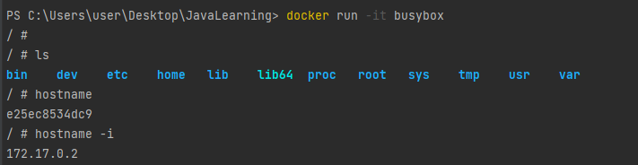
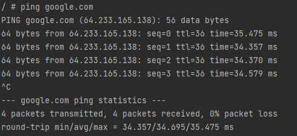

# Введение в Docker
## Содержание
* Теория
  * [Docker](#docker)
  * [Контейнеры](#containers)
  * [Образы](#image)
  * [Репозитории](#repository)
* Основные команды 
  * [Команды](#commands)
* Пример
  * [Создание контейнера busybox](#busyBoxexample)
---

<a name = "docker"></a>

# Docker

**Docker** позволяет создавать контейнеры, автоматизировать их запуск и развертывание, управляет жизненным циклом.
Он позволяет запускать множество контейнеров на одной хост-машине.

Преимущества Docker:
- Приложения запускаются в изолированной среде;
- Легко запускать приложения на разных серверах;
- Все зависимости приложений устанавливаются внутри контейнеров;
- Легко масштабировать путем увеличения количества контейнеров (распределять нагрузку
на приложение)

### Компоненты Docker

- **CLIENT** (клиент) - запускается в командной строке и с помощью него можно подключаться к службе.
- **DAEMON** (служба) - отвечает за задачи по созданию контейнеров и обработки запросов клиентов
- **HOST** (хост) - пк, на котором запущен Docker.
- **CONTAINER** - Контейнер.
- **IMAGE** (образ) - основа для создания контейнеров. Из одного образа можно создать множество разных независимых друг от друга контейнеров.
- **REPOSITORY** (репозиторий) - множество различных версий образов.
- **REGISTRY** (реестр) - множество репозиториев. Самый популярный - DockerHub.

# Контейнеры

<a name = "containers"></a>

**Контейнеры** используются для развертки приложения и изолирования приложений друг от друга. Контейнеры
упаковывают в процессе сборки приложение и все его зависимости - библиотеки, системные утилиты, файлы настройки
в единый **образ**. Образ может быть создан на основе другого образа. Сам контейнер - выполняющийся образ.

**Контейнеризация** - процесс создания виртуальной машины, внутри которой запускается приложение.

Контейнер отличается от виртуального сервера тем, что внутри контейнера нет своей полноценной ОС.

### Преимущества использования контейнеров
1. **Упрощает перенос** приложения на другую инфраструктуру;
2. Приложения работают только внутри контейнеров и не имеют доступа к основной операционной системе. Это **повышает
   безопасность приложений**:они не смогут случайно или умышленно навредить основной системе. Если приложение
   в контейнере завершится с ошибкой или зависнет, это никак не затронет основную ОС.
3. Контейнеры приближают к **микросервисной архитектуре** (подход к разработке, при котором приложение на небольшие
   независмые компоненты. Противопоставляется монолитной архитектуре, где все части системы сильно связаны друг с другом).

## Создание, удаление и запуск локальных контейнеров

### Список запущенных и остановленных контейнеров

```dockerfile
docker ps -a
```

### Запустить контейнер на основании образа
Если данного образа нет в локальном хэше, то он будет загружен с DockerHub.

1. Docker-клиент подключается к Docker-сервису.
2. Docker-сервис ищет образ или скачивает его с DockerHub.
3. После этого Docker-сервис создает новый контейнер на основании образа.
4. Внутри контейнера запускается процесс, выполняющий команды.

Docker автоматически останавливает контейнеры, в которых нет активных процессов.

```dockerfile
docker run название
docker run название:тег
```

### Удалить контейнер

```dockerfile
docker rm id-контейнера-или-название
```

### Просмотр локальных образов

```dockerfile
docker images
```

---

<a name = "image"></a>

# Образы

Представляет собой множество файлов. Из одного образа можно создать множество контейнеров.
> Образ отличается от контейнера тем, что в контейнере есть запущенные процессы, т. е. они выполняют какие-то команды, которые описаны в образе.
> Образы статичны, а контейнеры динамичны

### Строение образов

Образ состоит из слоев, каждый слой представляет собой набор файлов (file system layers).
К первоначальному, **базовому слою**, примыкают другие слои, которые используются в разных образах. То есть, может быть
несколько образов, слои которых пересекаются.

Свойства

- Все слои read-only;
- Образы можно перемещать и удалять;
- Образы хранятся в репозиториях;
- Есть официальные образы и обррзы сообшества;

**Каждый образ - набор слоев, а каждый слой - набор файлов.**

## Создание собственного образа

Свойства:
- Для создания образа необходим **Dockerfile** - специальный файл, инструкции для создания нового образа. Один Dockerfile - один образ. -
- Dockerfile помещают в корень папки приложения.
- При создании образа можно указать имя и тег для образа.
- На основании готового образа можно создавать контейнеры.

Пример инструкции Dockerfile:
```dockerfile
FROM python:alpine
# FROM - то, какой базовый образ будет использоваться  
WORKDIR /app
# WORKDIR - рабочая папка внутри образа. Рекомендуется всегда создавать диекторию для контейнера
COPY . .
# Копируем все файлы из локальной текущей папки в папку WORKDIR внутри контейнера. Папка app станет текущей для всех файлов контейнера.
CMD ["python", "main.py"]
# Указывает на то, какая команда выполнится на при запуске контейнера. Процесс python, файл main.py
```

Команда для запуска процесса создания образа: `docker build .`

Добавление имени и тэга для образа: `docker build . -t my-calendar:4.1.3`

<a name = "repository"></a>

## Репозитории

Набор версий образов, с различными тегами.

Свойства:
- В репозитории хранятся разные версии образа;
- Разные версии помечаются разными тегами;
- Одна и та же версия может иметь несколько тегов;

---

<a name = "commands"></a>

# Команды
## Наиболее применяемые команды
### Общие команды

| Команда                                                 | Описание                                | Флаги                                                         | Пример                          |
|---------------------------------------------------------|-----------------------------------------|---------------------------------------------------------------|---------------------------------|
| `docker version`                                        | Текущая версия Docker и его компонентов |                                                               |                                 |

### Контейнеры

| Команда                                                           | Описание                                | Флаги                                                                                                                                               | Пример                                                                                                    |
|-------------------------------------------------------------------|-----------------------------------------|-----------------------------------------------------------------------------------------------------------------------------------------------------|-----------------------------------------------------------------------------------------------------------|
| `docker ps`                                                       | Список запущенных контейнеров           | `-a` - Остановленные контейнеры, которые были запущены ранее.                                                                                       | docker ps<br/><br/>docker ps -a                                                                           |
| `docker container inspect <id_контейнера>`                        | Получить информацию о контейнере        |                                                                                                                                                     | ddocker container inspect b274b47bc835                                                                    |
| `docker <имя_образа>`<br/><br/>`docker <имя_образа>:тег`          | Запустить контейнер                     | `-d` - запуск в фоновом режиме<br/>`--name <имя>` - задание пользовательского имени<br/>`--rm` - автоматическое удаление контейнера после остановки | docker run nginx<br/>docker run nginx:alpine<br/>docker run -d nginx<br/>docker run --name my_nginx nginx |
| `docker run -p <внешний_порт>:<порт_контейнера> <имя_образа>`     | Публикация портов контейнеров           |                                                                                                                                                     | docker run -p 8080:80 nginx                                                                               |
| `docker exec <id_контейнера> <название_процесса>`                 | Запустить процесс в контейнере          | `-it` - режим интерактивного терминала                                                                                                              | docker exec -it 287cc3171cec bash                                                                         |
| `docker stop <id_контейнера>`                                     | Остановка контейнера                    |                                                                                                                                                     | docker stop b274b47bc835                                                                                  |
| `docker rm <id_контейнера>`<br/><br/>`docker rm <имя_контейнера>` | Удалить контейнер                       |                                                                                                                                                     | docker rm b274b47bc835                                                                                    |
| `docker container prune `                                         | Удаление всех остановленных контейнеров |                                                                                                                                                     |                                                                                                           |

### Образы

| Команда               | Описание                   | Флаги                                                 | Пример                                                 |
|-----------------------|----------------------------|-------------------------------------------------------|--------------------------------------------------------|
| `docker images`       | Просмотр локальных образов |                                                       |                                                        |
| `docker build <путь>` | Создание образа            | `-t <имя>:<тег>` - добавление имени и тэга для образа | docker build .<br/>docker build . -t my-calendar:4.1.3 |

---

<a name = "busyBoxexample"></a>

# Создание контейнера busybox

Представляет собой контейнер с оболочкой над Linux.

Позволяет выполнять команды. Машина внутри контейнера имеет свое имя и выделеный под нее IP-адресс.



Обладает подключением к интернету



### Создание контейнера на основе образа _busybox_
После установки контейнер прекращает работу из-за отсутствия подключения.

```dockerfile
docker run busybox
```

### Подключение к процессу контейнера

Вызов интерактивного терминала для контейнера.

```dockerfile
docker run -it название
```

### Остановка контейнера

Производится завершением процессов внутри него или выполением команды
```dockerfile
docker stop id-контейнера
```

### Удаление всех остановленных контейнеров
```dockerfile
docker container prune
```

### Подключение томов

Будет создан новый контейнер на основании образа. Сдержимое папки внутри контейнера будет заменено содержимым локальной папки.

```dockerfile
docker run подключение-тома путь-к-локальной-папке:путь-к-папке-внутри-контейнера nginx
docker run -v ${PWD}:/usr/share/nginx/html nginx
```