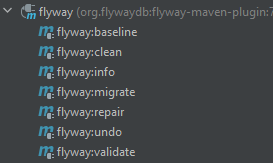
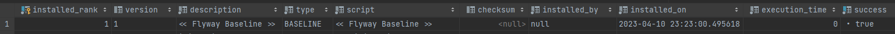

# Миграции БД | FlyWay

**Миграции** — аналог системы контроля версий для базы данных. Они позволяют  изменять структуру БД так,
чтобы все ее пользователи оставались в курсе изменений других участников.

Зависимость
```java
<dependency>
    <groupId>org.flywaydb</groupId>
    <artifactId>flyway-core</artifactId>
    <version>9.16.3</version>
</dependency>
```

Плагин для настройки подключения
```
<plugin>
    <groupId>org.flywaydb</groupId>
    <artifactId>flyway-maven-plugin</artifactId>
    <version>7.14.0</version>
    <configuration>
        <url>jdbc:postgresql://localhost:5432/clients</url>
        <user>postgres</user>
        <password>postgres</password>
    </configuration>
</plugin>
```

## Maven Plugins



- `baseline`: обновить информацию о миграциях
- `migrate`: произвести миграцию

## Начальная точка для миграций
1. `flywat:baseline`


2. Application properties:
```
spring.jpa.show-sql = true
spring.jpa.hibernate.ddl-auto = create
```
3. Создаем файл resources/db.migration/V1__название_файла.sql
4. Копируем HIBERNATE код создания таблицы
5. Application properties:
```
spring.jpa.hibernate.ddl-auto = validate
```

## Дальнейшие миграции
1. `flyaway:migrate`
2. Новая версия файла Vверсия__название.sql