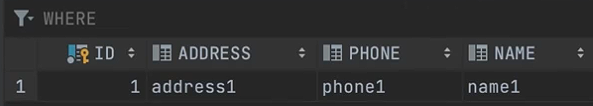

### Встраиваемые таблицы | Переиспользование полей

Если несколько сущностей имеют общий набор полей
```java
public class Employee {
  // ...
  private String companyCode;
  private Grade grade;
  // поля повторяются с классом Client
  private String address;
  private String phoneNumber;
  // ...
}
```
```java
public class Client {
  // ...
  private boolean isFavoriteClient;
  // поля повторяются с классом Employee
  private String address;
  private String phoneNumber;
  // ...
}
```

То имеет смысл вынести общие поля и методы в отдельный класс.

```java
@Embeddable
public class Contact {
  // эти поля присутствуют и в Client, и в Employee
  private String address;
  private String phoneNumber;
}
```
Для общего класса НЕ БУДЕТ создаваться отдельная таблица, но поля этого класса будут добавлены
к полям сущности, в которую этот класс инжектируется;

```java
public class Employee {
  // ...
  private String companyCode;
  private Grade grade;

  // отдельная таблица не создается, в БД вместо этого поля будут поля класса Contact, т.е.
  // private String address;
  // private String phoneNumber;
  private Contact contact;  
  // ...
}
```
```java
public class Client {
  // ...
  private boolean isFavoriteClient;

  // отдельная таблица не создается, в БД вместо этого поля будут поля класса Contact, т.е.
  // private String address;
  // private String phoneNumber;
  private Contact contact;
  // ...
}
```

Таблица employers


---

### Поле-коллекция в сущности @Entity

Хранить коллекции можно следующим способом

```java
@ElementCollection // обязательная аннотация для коллекций
@CollectionTable(name = "employers_skills", joinColumns = @JoinColumn(name = "employee_id")) // Коллекция будет храниться в отдельной таблице "employers_skills", связь "One-to-Many" осуществляется по полю "employee_id"
@Column(name = "skill") // переименовываем название столбца в связанной таблице
private List<String> skills = new ArrayList<>();
```

Использование Map в качестве структуры для хранения данных
```java
@ElementCollection // обязательная аннотация для коллекций
@CollectionTable(name = "employers_skills", joinColumns = @JoinColumn(name = "employee_id")) // Коллекция будет храниться в отдельной таблице "employers_skills", связь "One-to-Many" осуществляется по полю "employee_id"
@MapKeyColumn(name = "skill") // задаем имя столбца для ключа Map
@Column(name = "age") // задаем имя столбца для значения Map
private Map<String, Integer> skills2Years = new HasMap<>();
```

---

### Создание индексов

```java
@Entity
@Table(
    name = "employees",
    indexes = {
        @Index(name = "name_index", columnList = "name"),
        @Index(name = "age_phone_number_index", columnList = "age, phone_number", unique = true)
    }
)
public class Employee {
  // ...
  private String name;
  private Integer age;
  @Column(name = "phone_number")
  private String phoneNumber;
  // ...
}
```


