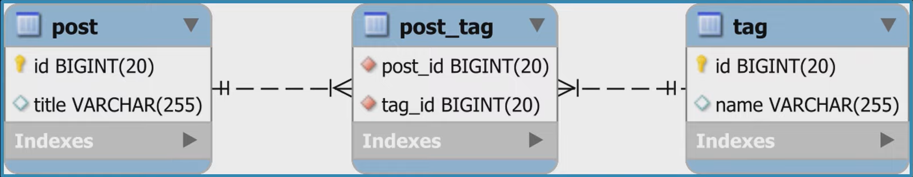
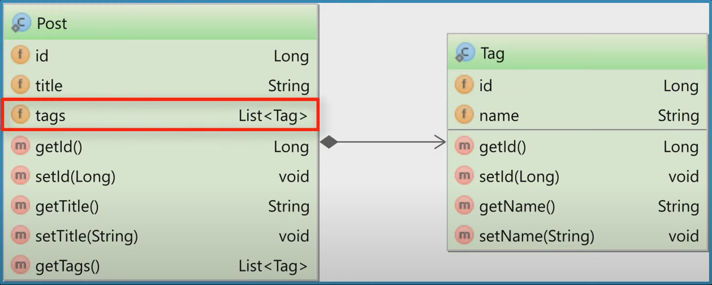
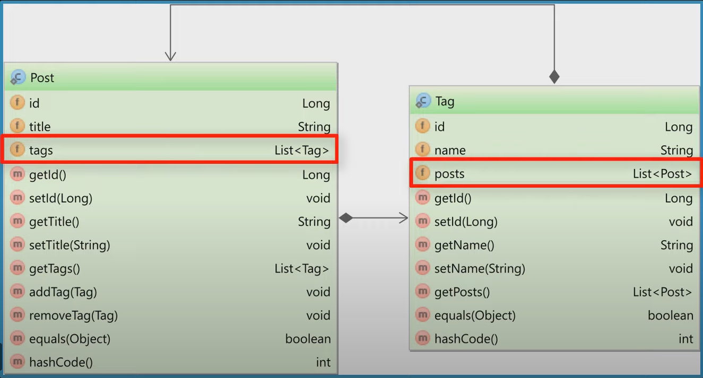
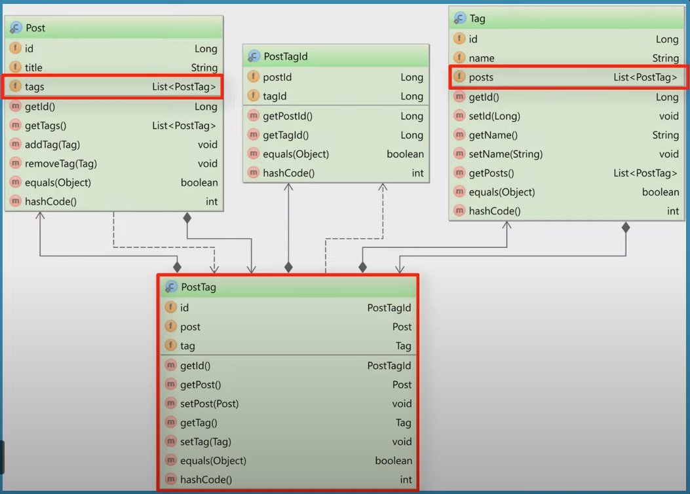

# Hibernate | Spring Data JPA

Содержание:
* [Основные понятия](#begin)
* [Entity](#entity)
* [Статусы жизненного цикла Entity объекта](#entityStatus)
* [Трансляция данных в БД | Ключевое слово flush](#flush)
* [Аннотации](#annotation)
* [Основные шаги работы с Hibernate | Spring Data JPA](#steps)
* [Отношение Many to many](#mtmRel)

<a name = "begin"></a>

# Основные понятия

Все технологии и фреймворки в Java работают на **спецификациях** (стандартах, правилах).
Они используются для того, чтобы не было хаоса, разных версий и тракотовок.

**JPA - Java Persistence API** - спецификация, документ, в котором описаны правила и API для
реализации принципов ORM для Java (аннотации, настройки, подход).

**ORM** - **Object-Relational Mapping** - концепция, позволяющая работать с БД как с объектами.

Представляет собой еще один слой между взаимодействием кода и БД, напрямую код к БД не
обращается, хотя это возможно.

**Hibernate** одна из самых популярных открытых реализаций последней версии спецификации.
JPA только описывает правила и API, а Hibernate реализует эти описания, впрочем у Hibernate (как и у многих других реализаций JPA)
есть дополнительные возможности, не описанные в JPA (и не переносимые на другие реализации JPA).

**Entity** - сущность - объект бизнес-логики. Основная программаная сущность - это entity
класс, который так же может использовать вспомогательные классы.

<a name = "entity"></a>

---

# Entity

`@Entity` - Эта аннотация указывает Hibernate, что данный класс является сущностью (entity bean). Такой класс должен иметь
конструктор по-умолчанию (пустой конструктор)

Entity класс может
- наследоваться как от других Entity классов, так и от не Entity классов;
- иметь не Entity наследника;
- может быть абстрактным классом;

**EntityManager** - интерфейс, описывающий API для всех основных операций над Entity, получние данных и других
сущностей JPA. Главный API для работы с JPA.

Основные оперции:
- операции над Entity:
  - **persist** - добавление Entity под управление JPA;
  - **merge** - обновление;
  - **remove** - удаление;
  - **refresh** - обновление данных;
  - **detach** - удаление из отслеживания JPA;
  - **lock** - блокирование Entity от изменения других thread;
- получение данных;
- работа с EntityGraph;
- общие операции;
  - close;
  - isOpen;
  - getProperties;
  - setProperty;
  - clear;

<a name="entityStatus"></a>

### Статусы жизненного цикла Entity объекта
1. new - объект создан, но при этом еще не имеет сгенерированного первичного ключа и пока не сохранен
в базе данных.
2. managed - объект создан, управляется JPA, имеет сгенерированные ключи.
3. detached - объект был создан, но не управляется (или больше не управляется) JPA.
4. removed - объект создал, управляется JPA,но будет удален после commit'a транзакции.

<a name="flush"></a>

### Трансляция данных в БД | Ключевое слово flush

При переводе JPA сущностей из одного состояния в другое, то есть при вызове методов сохранения и 
удаления `(persist()`, `merge()`, `remove()`), немедленного **выполнения SQL-команд не происходит**.
SQL-команды накапливаются, а выполнение их откладывается до:

1. Подтверждения транзакции `commit()`.
2. Выполнения JPQL и HQL запросов.
3. Выполнения native SQL запросов.
4. Вызова метода `flush()`

---

<a name = "annotation"></a>

## Аннотации

`@Table` - С помощью этой аннотации мы говорим Hibernate,  с какой именно таблицей необходимо связать (map) данный класс.
Аннотация @Table имеет различные аттрибуты, с помощью которых мы можем указать имя таблицы, каталог, БД и уникальность столбцов в таблец БД.

`@Id` - С помощью аннотации @Id мы указываем первичный ключ (Primary Key) данного класса.

`@GeneratedValue` - Эта аннотация используется вместе с аннотацией @Id и определяет такие паметры, как strategy и generator.

`@Column` - Аннотация @Column определяет к какому столбцу в таблице БД относится конкретное поле класса (аттрибут класса).
Наиболее часто используемые аттрибуты аннотации @Column такие:
- **name** - Указывает имя столбца в таблице
- **unique** - Определяет, должно ли быть данноезначение уникальным
- **nullable** - Определяет, может ли данное поле быть NULL, или нет.
- **length** - Указывает, какой размер столбца (например колчиство символов, при использовании String).

---

<a name = "steps"></a>

## Основные шаги работы с Hibernate | Spring Data JPA

1. **Конфигурация приложения**. Hibernate позволяет конфигурировать взаимодействие с БД через файл конфигурации или при
помощи применения  Java-аннотаций. Spring Boot предоставляет возможность конфигурации в файле `application.properties`

Файл application.properties:
```java
# Spring properties
        spring.datasource.url=URL
        spring.datasource.username=USERNAME
        spring.datasource.password=PASSWORD

# Hibernate properties
        spring.jpa.database-platform = org.hibernate.dialect.PostgreSQL94Dialect
        spring.jpa.show-sql = true
        spring.jpa.hibernate.ddl-auto = update
        spring.jpa.hibernate.naming.implicit-strategy = org.hibernate.boot.model.naming.ImplicitNamingStrategyJpaCompliantImpl
        spring.jpa.properties.hibernate.format_sql=true
```
2. **Создание класса-сущности**. Пакет `model`, POJO-класс, который получит отображение в виде сущности в БД.
```java
// POJO-образующие
@Data
// Класс является сущностью
@Entity
// В БД отображается в таблицу с именем students
@Table(name = "students")
public class Student {

    // Поле первичного ключа
    @Id
    // Автоинкремент
    @GeneratedValue(strategy = GenerationType.IDENTITY)
    private Long id;

    // Столбец в таблице, может ли быть null
    @Column(name = "first_name", nullable = false)
    @NotEmpty(message = "wrong first name")
    @Size(min = 2, max = 50, message = "Parameter's length must be between 2 and 50 symbols")
    private String firstName;

    @Column(name = "last_name", nullable = false)
    @NotEmpty(message = "wrong last name")
    private String lastName;

    @Column(name = "email", nullable = false)
    @NotEmpty(message = "Wrong email")
    @Email(message = "Wrong email")
    private String email;
}
```
3. **Создание репозитория**. Пакет `repository`, интерфейс наследуется от
JpaRepository<ТипОбъекта, ТипId> - класса, реализующего основной функционал и API для взаимодействия
с JPA.

```java
public interface StudentRepository extends JpaRepository<Student, Long> {}
```
Аннотация @Repository указывать не нужно, так как вышестоящие по иерархии классы уже содержат ее.

4. **Обработка исключений**. Пакет `excepitions`, обработка исключения, связанного с отсутствием требуемого ресурса.
```java
// Возвращаемый статус-код 
@ResponseStatus(value = HttpStatus.NOT_FOUND)
// Набор геттеров для класса
@Getter
public class ResourceNotFoundException extends RuntimeException {

    private final String resourceName;
    private final String fieldName;
    private final Object fieldValue;

    public ResourceNotFoundException(String resourceName, String fieldName, Object fieldValue) {
        super(String.format("%s not found with %s : '%s'", resourceName, fieldName, fieldValue));
        this.resourceName = resourceName;
        this.fieldName = fieldName;
        this.fieldValue = fieldValue;
    }
}
```

5. **Сервис-слой**. Реализация бизнесс-логики при помощи средств JPA, пакет `service`.

Интерфейс
```java
public interface StudentService {
    
  Student saveStudent(Student student);
  List<Student> getAllStudents();
  Student getStudentById(Long id);
  Student updateStudent(Long id, Student updatedStudent);
  void deleteStudent(Long id);
}
```
Реализация
```java
@Service
public class StudentServiceImpl implements StudentService {

    private final StudentRepository studentRepository;

    @Autowired
    public StudentServiceImpl(StudentRepository studentRepository) {
        this.studentRepository = studentRepository;
    }

    @Override
    public Student saveStudent(Student student) {
        return studentRepository.save(student);
    }

    @Override
    public List<Student> getAllStudents() {
        return studentRepository.findAll();
    }

    @Override
    public Student getStudentById(Long id) {
        return studentRepository.findById(id).orElseThrow(() -> new ResourceNotFoundException("Student", "Id", id));
    }

    @Override
    public Student updateStudent(Long id, Student updatedStudent) {
        Student existedStudent = studentRepository.findById(id).orElseThrow(
                () -> new ResourceNotFoundException("Student", "Id", id));

        existedStudent.setFirstName(updatedStudent.getFirstName());
        existedStudent.setLastName(updatedStudent.getLastName());
        existedStudent.setEmail(updatedStudent.getEmail());

        studentRepository.save(existedStudent);
        return existedStudent;
    }

    @Override
    public void deleteStudent(Long id) {
        studentRepository.findById(id).orElseThrow(() -> new ResourceNotFoundException("Student", "Id", id));
        studentRepository.deleteById(id);
    }
}
```
6. Контроллер. Пакет `controller`/
```java
@RestController
@RequestMapping("/api/students")
public class StudentController {

    private final StudentService studentService;

    public StudentController(StudentService studentService) {
        super();
        this.studentService = studentService;
    }

    @PostMapping("/add")
    public ResponseEntity<Student> saveStudent(@RequestBody Student student) {
        return new ResponseEntity<Student>(studentService.saveStudent(student), HttpStatus.CREATED);
    }

    @GetMapping
    public List<Student> getAllStudents() {
        return studentService.getAllStudents();
    }

    @GetMapping("{id}")
    public ResponseEntity<Student> getStudentById(@PathVariable("id") Long id) {
        return new ResponseEntity<Student>(studentService.getStudentById(id), HttpStatus.OK);
    }

    @PutMapping("{id}/update")
    public ResponseEntity<Student> updateStudent(@PathVariable("id") Long id, @RequestBody Student student) {
        return new ResponseEntity<Student>(studentService.updateStudent(id, student), HttpStatus.OK);
    }

    @DeleteMapping
    public ResponseEntity<String> deleteStudent(Long id) {
        studentService.deleteStudent(id);
        return new ResponseEntity<String>("Student deleted successfully!", HttpStatus.OK);
    }
}
```

---

<a name = "mtmRel"></a>

# Отношение Many To Many

Связь между двумя родительскими сущностями осуществляется через дочернюю.
Родители предствляют собой независимые сущности, не зависящие от других сущностей.



Виды
- однонаправленная - только одна сторона отображает отношение;
- двунаправленная - обе стороны отображают отношение.

## Unidirectional




The Post Entity
```java
@ManyToMany(cascade = {CascadeType.PERSIST, CascadeType.MERGE})
@JoinTable(name = "post_tag", // промежуточная таблица
    joinColumns = @JoinColumn(name = "post_id"), // поле для связи с дочерней сущностью
    inverseJoinColumns = @JoinColumn(name = "tag_id") // поле для связи со вторым родителем
)
private Set<Tag> tags = new HashSet<>();
```

## Bidirectonal



The Post Entity

```java
@ManyToMany(cascade = {CascadeType.PERSIST, CascadeType.MERGE})
@JoinTable(name = "post_tag", // промежуточная таблица
    joinColumns = @JoinColumn(name = "post_id"), // поле для связи с дочерней сущностью
    inverseJoinColumns = @JoinColumn(name = "tag_id") // поле для связи со вторым родителем   
)
private Set<Tag> tags = new HashSet<>();

// Методы для взаимосвязи
public void addTag(Tag tag) {
    tags.add(tag); //добавили элемент в текущий объект
    tag.getPosts().add(this); // Добавили текущий объект в связанный
}

public void removeTag(Tag tag) {
    tags.remove(tag);
    tag.getPosts().remove(this);
}
```
The Tag Entity
```java
@ManyToMany(mappedBy = "tags") // Поле, с которым связываем
private Set<Post> posts = new HashSet<>();
```
## Mapping

Получение данных из связанных таблиц через вспомогательные сущности.



Вспомогательный класс PostTagId использует аннотацию `@Embeddable`, чтобы объявить, что класс может быть встроен в другие объекты.

```java
@Embeddable
public class PostTagId implements Serializable {
    
    @Column(name = "post_id")
    private Long postId;
    
    @Column(name = "tag_id")
    private Long tagId;
    
    public PostTagId(){}
  
    public PostTagId(Long postId, Long tagId) {
        this.postId = postId;
        this.tagId = tagId;
    }
    // Getter, Setter, HashCode, Equals etc
}
```

Класс PostTag связывает сущности Post и Tag. 

Аннотация `@EmbeddedId` указывает на id встраиваемого объекта, `@MapsId` - поле встраиваемого объекта

```java
@Entity
public class PostTag {
    @EmbeddedId
    private PostTagId id;
    
    @ManyToOne
    @MapsId("postId")
    private Post post;
    
    @ManyToOne
    @MapsId("tagId")
    private Tag tag;
}
```

При этом сущности Post и Tag больше не будут использовать аннотацию `@ManyToMany`.
Вместо этого отношение обрабатывается как двунаправленная `@OneToMany`

Класс Post
```java
@OneToMany(mappedBy = "post",
    cascade = CascadeType.ALL,
    orphanRemoval = true
)
private List<PostTag> tags = new ArrayList<>();

public void removeTag(Tag tag) {
    for (Iterator<PostTag> interator = tags.iterator(); iterator.hasNext(); ) {
        PostTag postTag = interator.next();
        if (postTag.getPost().equals(this) && postTag.getTag().equals(tag)) {
            iterator.remove();
            postTag.getTag().getPosts().remove(postTag);
            postTag.setPost(null);
            postTag.setTag(null);
            break;
        }
    }    
}
```

Класс Tag
```java
@OneToMany(mappedBy = "tag", cascade = CascadeType.ALL, orphanRemoval = true)
private List<PostTag> posts = new ArrayList<>();
```


