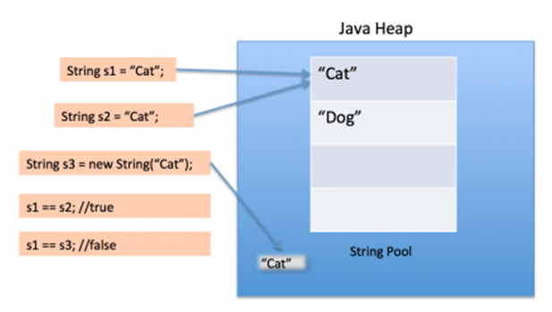

# String
## Сравнение строк

Для сравнения строк используются методы `equals()` и `equalsIgnoreCase()`, который не учитывает регистр символов.

В Java существует так называемый **String Pool**, в котором хранятся **созданные строки**. При создании очередной строки,
JVM сначала ищет такую строку в String Pool. **Если такая строка уже есть, то она возвращается вместо создания новой**. 

**String Pool не используется**, если строка создается с помощью оператора **new**.
`String str = new String();`



Пример:
```java
public class Equals {
    public static void main(String[] args) {
        String str1 = "one";
        String str2 = "one";
        String str3 = new String("one");

        System.out.println(str1 == str2);
        System.out.println(str3 == str1);
    }
}
```
Результат:

```
true
false
```

## Сортировка строк

Для сортировки строк можно использовать метод `compareTo()`.

Резултат работы `String str1.compareTo(str2)`:
- _<0_ - str1 < str2;
- _==_ 0 - строки эквивалентны;
- _>0_ - str1 > str2.

## Методы isEmpty(), isBlank()
Метод `isEmpty()` проверяет пустая ли строка. Возвращает true, только если длина строки равна 0.

Метод `isBlank()` возвращает true, если строка пуста или содержит только пробелы (Java 11).

# Отличие StringBuilder и StringBuffer

Классы StringBuilder и StringBuffer **используются**, когда возникает необходимость сделать **много изменений в строке**.

Класс **String** - **неизменяемый**, в то время как **StringBuilder и StringBuffer изменяемы**.

> Методы StringBuffer является безопасными для потоков (синхронизированны), а методы StringBuilder - не безопасны.

> Методы StringBuilder быстрее, чем методы StringBuffer. 

## Основные методы

- `charAt(индекс символа)` - возвращает символ в указанной позиции;
- `setCharAt(1, 'i')` - изменяет символ в указанной позиции;
- `append("I Java!")` - присоединяет подстроку к строке; 
- `insert(2, "like ")` - вставляет подстроку в указанную позицию;
- `reverse()` - инвертирует строку;
- `delete(4, 7)` - удаляет подстроку включая с первого символа не включая последний символ;
- .replace(1, 5, "=============") - заменяет подстроку включая с первого символа не включая последний символ на другую
подстроку;
