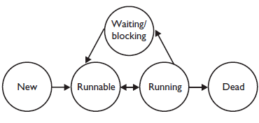

# Потоки

**Поток** - абстракция, последовательно выполняющая команды внутри процесса.
При многопоточности команды выполняются параллельно. 

**Процесс** — экземпляр программы во время выполнения, независимый объект, которому выделены системные ресурсы
(например, процессорное время и память). Каждый процесс выполняется в отдельном адресном пространстве:
один процесс не может получить доступ к переменным и структурам данных другого.

>Если процесс хочет получить доступ к чужим ресурсам, необходимо использовать межпроцессное взаимодействие.
Это могут быть конвейеры, файлы, каналы связи между компьютерами и многое другое.
 
### Отличия потока от процесса 

- Поток существует внутри процесса
- Каждый поток может работать с одной и той же областью памяти, в отличие от процессов, которые не могут получить
доступ к памяти другого процесса

## Способы создания потока
- Создать потомка класса `Thread` и переопределить метод `run`, запускающий поток; <br>
- Создать объект класса `Thread`, передав ему в конструкторе экземпляр класса, реализующего интерфейс `Runnable`. <br> Этот интерфейс содержит метод` run()`,
который будет выполняться в новом потоке. Поток закончит выполнение, когда завершится его метод `run()`; **БОЛЕЕ ПРЕДПОЧТИТЕЛЬНЫЙ ВАРИАНТ**
- Вызвать метод `submit()` у экземпляра класса реализующего интерфейс ExecutorService, передав ему в качестве
параметра экземпляр класса реализующего интерфейс Runnable или Callable (содержит метод `call()`, в котором описывается логика выполнения).

> Потоки совместно используют:
> - переменные класса;
> - динамически распределяемую память (кучу);
> - системные ресурсы, выделенные процессу;
> 
> При этом каждый поток имеет свои собственные локальные переменные (т.е. свой собственный стек).

## Вопросы
**Что такое поток выполнения?**<br>
Отдельный процесс со своим собственным стэком.

**Что такое поток в Java?**<br>
- объект класса Thread;
- поток выполнения.

---

# Класс Thread | интерфейс Runnable

Используется для создания нового потока.

### Создание простых потоков

1. Имплементация интерфейса Runnable.
```java
public class MyRunnable implements Runnable {

    @Override
    public void run() {
        System.out.println("Thread is running");
    }
}
```

2. Содание потоков в методе main. Метод `start()` - это специальный метод, создающий новый поток, в котором будет
выполняться метод `run()`. Метод `run()` запускает поток.
```java
public class MyRunnableDemo {
    public static void main(String[] args) {
        MyRunnable myRunnable = new MyRunnable();

        Thread thread1 = new Thread(myRunnable);
        Thread thread2 = new Thread(myRunnable);
        Thread thread3 = new Thread(myRunnable);

        thread1.start();
        thread2.start();
        thread3.start();
    }
}
```

### Получение имени текущего потока

Потоком можно управлять через объект `Thread`. Чтобы делать это, можно получить ссылку на него вызовом метода
`currentThread()`, который является `public` `static` методом класса `Thread`.

1. Имплементация интерфейса Runnable.
```java
public class NameRunnable implements Runnable{
    @Override
    public void run() {
        System.out.println("Thread is running with name " + Thread.currentThread().getName());
    }
}
```
2. Запуск потоков.
```java
public class ThreadsDemo {
    public static void main(String[] args) {
        NameRunnable nameRunnable = new NameRunnable();

        Thread thread1 = new Thread(nameRunnable);
        thread1.setName("first");
        thread1.start();

        Thread thread2 = new Thread(nameRunnable);
        thread2.setName("second");
        thread2.start();
    }
}
```

## Вопросы
1. **Как создать поток расширяя класс `java.lang.Thread`?**<br>
унаследовать/расширить класс и переопределить метод `run`.<br><br>

4. **Какой метод класса `Thread` содержит действия выполняемые при запуске нового потока?**<br>
метод `run`.<br><br>

7. **Как создать поток расширяя класс `java.lang.Thread`?**<br>
унаследовать/расширить класс и переопределить метод `run`.<br><br>

10. **Как создать новый поток?**<br>
- Расширить класс `Thread`;
- Реализовать интерфейс `Runnable`.<br><br>

13. **Как изменить имя потока?**

```java
    Thread myNewThread = new Thread(runnable);
    myNewThread.setName("NewName");
```

16. **Как получить имя текущего потока?** <br>
`Thread.currentThread().getName()`.<br><br>

# Состояния потоков
Поток может находиться в одном из следующих состояний:
1. `New` - объект класса `Thread` создан, но еще не запущен. Он не является потоком выполенния и не выполнения.<br><br>
2. `Runnable` - поток готов к выполнению, но планировщик еще не выбрал его.<br><br>
3. `Running` - поток выполняется.<br><br>
4. `Waiting/Blocked/Sleeping` - поток блокирован или ждет окончания работы другого потока.<br><br>
5. `Dead` - поток завершен (после завершения метода `run()`). Будет выброшено исключение при попытке вызвать метод `start()` для dead потока.

> Существет перечисление `Thread.State`, содержащее значения возможных состояний потока: NEW, RUNNABLE, BLOCKED, WAITING,
TIMED_WAITING, TERMINATED. <br><Br>
> **Получить текущее состояние потока можно вызовом метода** `Thread.getState()`.



# Переключение между потоками

**Планировщик потоков** - часть JVM, которая решает какой поток должен выполнится в каждый конкретный момент времени и какой
поток нужно приостановить.

Действия при переключении контекста
1. Сохранение контекста потока, закончившего выполнение;
2. Помещение этого потока в конец очереди, соответствующей его приоритету;
3. Загрузка контекста потока из очереди готовых к выполнению с наибольшим приоритетом;
4. Удаление из очерели загруженного потока и начало его выполнения.

## Методы, позволяющие влиять на планировщика потоков

* Методы класса java.lang.Thread:
  * public static void sleep(long millis) throws InterruptedException
  * public static void yield()
  * public final void join() throws InterruptedException
  * public final void setPriority(int newPriority) // 
* Методы класса java.lang.Object:
  * public final void wait() throws InterruptedException
  * public final void notify()
  * public final void notifyAll()

### Метод Thread.sleep()

Мы можем приостановить выполнение потока на заданное время с помощью статического метода `Thread.sleep()`.

Причины:
- поток выполняется слишком быстро;
- для переключения контекста на другой поток.

Пример
1. Имплементация интерфейса Runnable.
```java
public class SleepRunnable implements Runnable{

  @Override
  public void run() {
    for (int i = 0; i < 5; i++) {
      System.out.println("Thread " + Thread.currentThread().getName() + ", i = " + i);
      try {
        Thread.sleep(1000);
      } catch (InterruptedException e) {
        e.printStackTrace();
      }
    }
  }
}
```
2. Запуск потоков.
```java
public class ThreadsDemo {
  public static void main(String[] args) {
    SleepRunnable sleepRunnable = new SleepRunnable();
    Thread thread1 = new Thread(sleepRunnable);
    thread1.setName("Phill");

    Thread thread2 = new Thread(sleepRunnable);
    thread2.setName("Ken");

    thread1.start();
    thread2.start();
  }
}
```

### Метод Thread.yield()
Когда метод `Thread.yield()` вызывается внутри потока, он сообщает планировщику потоков, что текущий поток считает, что он
сделал достаточное количество работы и готов уступить время процессора другим потокам. 

После вызова этого метода
планировщик может выбрать другой поток для выполнения, а не продолжать выполнение текущего.

### Метод Thread.join()

 Приостанавливает выполнение текущего потка до тех пор, пока другой поток не закончит свое выполнение.

`void join(long millis)` – этот метод приостановит выполнение текущего потока на указанное время в миллисекундах.
Выполнение этого метода зависит от реализации ОС, поэтому Java не гарантирует, что текущий поток будет ждать указанное вами время.