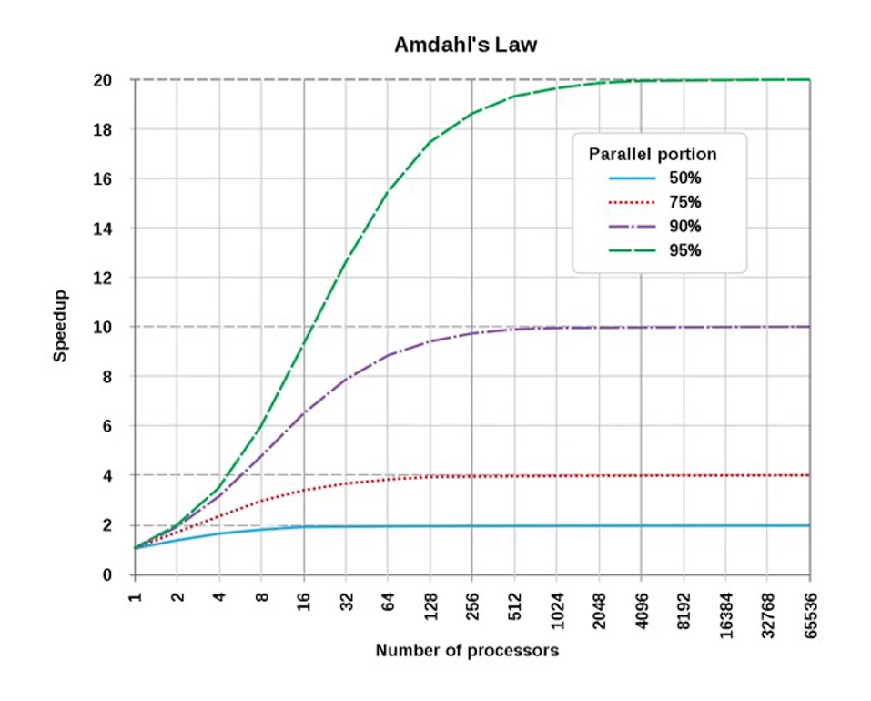

## Потоки vs процессы

В начале выполнения процесс состоит из одного потока. Потоки могут создавать новые потоки в пределах одного процесса.

Все потоки имеют общие сегменты кода и данных, что позволяет им взаимодействовать друг с другом.

Каждый поток имеет свой отдельный стек выполнения. И важный момент — единицей планирования операционной системы является поток.

Поток — это абстракция для операционной системы.

В некоторых языках программирования, например C, мы можем написать программу, которая будет выполняться без потоков прямо на железе. В Java такое выполнить невозможно.

Так как операционная система занимается управлением ресурсов, в любой момент ОС сможет усыпить поток и передать вычислительные ресурсы для другого потока.

Отсутствует гарантия, что поток доживет до какой-то точки. Его в любой момент могут завершить снаружи.

Также отсутствует гарантия завершения потока, мы снаружи принудительно не сможем завершить поток, придется дожидаться, пока поток сам завершится.

Стоит тут так же отметить, что существует возможность случайного пробуждения. Его следует корректно обрабатывает в тех случаях, когда мы с помощью операции sleep пытаемся усыпить свой поток. После пробуждения, мы должны вновь проверить наступление ожидаемого условия иначе же заснуть. Мы еще ни раз обратим внимание на этот момент.

Рассмотрим плюсы и минусы применения множества потоков и множества процессов.

Потоки:

Быстрее создаются.
Проще код.
Быстрее обмен данными.
Процессы:

Надежность (обрабатываем ошибки).
Безопасность (один процесс не сможет прочитать данные другого).

Если для общения потоков друг с другом используется общая память, то для межпроцессного взаимодействия есть целый ряд возможных способов связи.

Межпроцессные взаимодействия Inter-process communication IPC могут быть следующими:

файл;
сигнал;
сокет;
канал;
именованный канал;
неименованный канал;
семафор;
разделяемая память;
обмен сообщениями;
проецируемый в память файл (mmap);
очередь сообщений;
почтовый ящик.

Есть две характеристики: latency (время ожидания) и thoughput (пропускная способность). В сравнении с примером слева пропускная способность кода справа выше, но и в то же время задержка увеличилась.

Просто так распараллеливать и получать ускорение с каждым потоком у нас не получится.

Закон Амдала показывает зависимость доли параллельного кода, количества вычислителей, то есть потоков к приросту производительности. То есть, увеличив количество параллельного кода до 95%, мы получим теоретическое максимальное ускорение в размере двадцатикратного прироста. Дальнейшее увеличение числа параллельных вычислителей уже не будет давать прироста производительности.

## 5 основных способов синхронизации коллекций

Линеаризуемость — для всех вариантов синхронизации.

Deadlock-free, Starvation-free — для подходов с блокировками.

Напомню, что линеаризуемостью называется свойство системы, при котором параллельное выполнение эквивалентно последовательному. То есть мы можем выстроить такую последовательность параллельных действий, при которых будет возможно финальное состояние системы. И оно будет выполняться в интервале от начала операции до ее завершения. И момент выполнения этого действия, лежащий в этом интервале, называется точкой линеаризации.

Deadlock-free — это гарантия, которая защищает от взаимных блокировок.

Starvation-free — это гарантия, при которой поток гарантированно выйдет из состояния блокировки и исключаются случаи, когда поток будет заблокирован на неопределенное время.

