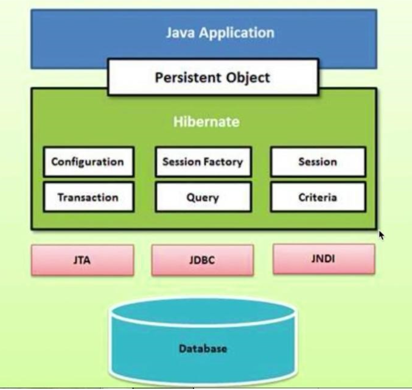

# Spring JDBC

В основе JPA и Hibernate лежит сущность Entity.
Entity представляет собой обычный класс POJO, с помощью которого происходит маппинг Java-объекта с таблицами в базе данных.

Так как в основе работы лежат классы, то единственным строгим требованием для сохраняемого класса является наличие конструктора без параметров.
И также для комфортной работы в некоторых приложениях требуется уделить внимание методам Equals и хэш-коду.

Почти все приложения используют данные, в большинстве случаев эти данные хранятся в течение длительного периода времени, так называемого persistent data. Долговременное хранение является одним из важных факторов в разработке, так как при приложение будет считаться малоэффективным, если оно теряет данные после рестарта.

Данные чаще всего хранятся в базе данных, Hibernate позволяет автоматизировать множество повторяющихся задач и тем самым упростить работу в этой области. 

Hibernate призван решить перечисленные проблемы JDBC, он позволяет структурировать проект, писать более чистый код и довольно быстро разрабатывать приложение.


Первый параметр – индивидуальность. Индивидуальность записи в базе данных осуществляется благодаря использованию первичных ключей. Индивидуальность объекта в Java обеспечивается использованием Equals и сравнением ссылок на объекты.

Второй параметр – связи. Связь между таблицами в базе данных осуществляется использованием внешних ключей. Связь между объектами в объектной модели осуществляется за счет использования ссылки на объекты.

Третий параметр – перемещение по связям. В базе данных перемещение по связи осуществляется с помощью Joins, а в объектной модели – с помощью геттеров и ссылок на объекты.

Четвертый параметр – наследование. Объектная модель может расширять базовый класс, но модель данных так не умеет.

## Преимущества Hibernate

Hibernate уменьшает код и сложность сопровождаемого слоя работы с базой данных, выступает мостом между моделью данных и объектной моделью, удаляет SQL из кода приложения, позволяет писать чистый код, используя принцип DRY. И еще один плюс – это открытый исходный код, который хорошо документирован и протестирован.

## Архитектура Hibernate

Внутри Hibernate располагаются объекты: Configuration, SessionFactory, Session, Transaction, Query, Criterion



## Зависимости

```java
<dependency>
    <groupId>org.springframework.boot</groupId>
    <artifactId>spring-boot-starter-data-jpa</artifactId>
</dependency>
```
Стартер spring-boot-starter-data-jpa предоставляет следующие зависимости:
1. Spring Data JPA: Основной компонент, который упрощает доступ к базам данных, управление сущностями и выполнение запросов.
2. Hibernate: По умолчанию используется как реализация JPA. Hibernate обеспечивает ORM (объектно-реляционное отображение), что упрощает взаимодействие с базами данных.
3. Spring Framework: Основные инфраструктурные компоненты Spring, такие как управление транзакциями и контекстами.
4. HikariCP: Быстрый пул подключений к базе данных по умолчанию, который обеспечивает эффективное управление соединениями.
5. Транзакционная поддержка: Компоненты для управления транзакциями, которые могут использоваться для обеспечения целостности данных.

## Identity Generators

Исользуются для генерации значений поля id (первичного ключа), задаются с помощью
аннотации `@GeneratedValue(strategy = GenerationType.<стратегия>)`. Выделяют 4 стратегии:
- **AUTO (по умолчанию)** - подбор лучшей стратегии (IDENTITY или SEQUENCE)
в зависимости от диалекта БД и типа ключа.
<br>Например, для id с числовым типом будет
использована SEQUENCE
```java
@Id
@Column(updatable = false, nullable = false)
@GeneratedValue(strategy = GenerationType.AUTO)
private Long id;
```
Но для типа UUID будет использоваться внутренний генератор хибернейта UUIDv4
```java
@Id
@Column(updatable = false, nullable = false)
@GeneratedValue(strategy = GenerationType.AUTO)
private UUID id;
// пример выше отобразится в пример ниже
@Id
@Column(name = "id", updatable = false, insertable = true)
@GeneratedValue(generator = "UUID")
@GenericGenerator(
    name = "UUID",
    strategy = "org.hibernate.id.UUIDGenerator"
)
private UUID id;
```
- **IDENTITY** - используется встроенный в БД тип данных столбца -identity - для генерации значения первичного ключа.
- **SEQUENCE** - **налучшая производительность** при правильной конфигурации. Используется последовательность – специальный объект БД для генерации уникальных значений.
- **TABLE** - худшая по производительности, стоит избегать.

Spring Data JPA
Spring Data JPA предоставляет дополнительные возможности для упрощения разработки приложений с помощью прикладного интерфейса JPA.

Этот подпроект используют для доступа к реляционным базам данных.

Интерфейсы. Repository
Spring Data предоставляет ряд интерфейсов. Один из них – Repository. Это маркерный интерфейс, который решает две основные задачи: определяет тип сущности и тип поля Id-сущности, а также позволяет Spring-контейнеру обнаружить интерфейсы, расширяющие этот интерфейс.

Интерфейс CrudRepository
Интерфейс CrudRepository расширяет Repository и предоставляет общие методы, необходимые для реализации Crud-операций. С ним доступны методы:

<S extends T> S save(S entity)
<S extends T> Iterable<S> saveAll(Iterable<S>entities)
Optional<T> findByld(ID id)
Iterable<T> findAll()
void deleteByld(ID id)
void deleteAll(Iterable<? extends T>entities) 
Интерфейс Paging And Sorting Repository 
Интерфейс Paging and Sorting Repository расширяет CrudRepository и добавляет методы, позволяющие сортировать и реализовывать постраничный вывод данных:

Iterable<T> findAll(Sort sort)
Page<T> findAll(Pageable pageable)
Интерфейс JPARepository

Интерфейс JPARepository расширяет Paging and Sorting Repository. Он добавляет методы, специфичные для JPA. Например, выполнение пакетных запросов.

Связи между таблицами. One-to-one
One-to-one – это связь между таблицами, при которой строка в таблице A может иметь не более одной совпадающей строки в таблице B. И наоборот.

Аннотация @OneToOne позволяет указать тип связи one-to-one.

Аннотация @JoinColumn позволяет указать поле, которое выступает связующим звеном между таблицами.

Связь one-to-many/many-to-one
One-to-many/many-to-one – связь, при которой строка в таблице A может иметь много строк в таблице B, но строка в таблице B может иметь только одну строку в этой таблице A.

Аннотации @OneToMany и @ManyToOne позволяют указать соответствующий тип связи.

Аннотация @JoinColumn позволяет указать поле, которое выступает связующим звеном между таблицами.

Связь many-to-many
Many-to-many – связь, при которой строка в таблице A может иметь много совпадающих строк в таблице B и наоборот.

Аннотация @ManyToMany позволяет указать тип связи many-to-many.

Аннотация @JoinColumn позволяет определить таблицу и поля для связи.

При реализации связи many-to-many создается промежуточная таблица, которая содержит поля связи как от таблицы A, так и от таблицы B.

Построение запросов
Spring Data JPA позволяет создавать запросы, используя определенный синтаксис наименования методов. Это значит, что больше нет необходимости прописывать SQL-запросы напрямую. Достаточно сформировать имя метода определенным образом и, согласно правилам именования, Spring трансформирует данное имя в SQL-запрос и направит его в базу данных.

Методы, которые начинаются на слово «find», выполняют поиск в базе данных. Прибавляя к «find» ключевое слово by, можно указать, по какому полю производить фильтрацию.

List<Student> findByName(String name) – это выражение позволяет отправить запрос в базу данных на получение всех полей из таблицы, но при этом будет применен фильтр по полю name.

К этому запросу можно добавить дополнительные ограничения. К примеру, если до этого SQL-запрос не учитывал регистр, то прибавив к имени метода «IgnoreCase» вы решите эту задачу.

List<Student> findByNameIgnoreCase(String name)
Для фильтрации по нескольким полям к запросу необходимо добавить условия и объединить их ключевым словом and.

List<Student> findByNameAndAge(String name, int age) – это выражение сформирует SQL-запрос, который выполнит фильтрацию по двум полям в базе данных.

Ключевые слова для формирования запроса

Существуют и другие ключевые слова:

Or – это объединение слов через ИЛИ

List<Student> findByNameOrAge(String name, int age)
In – добавление фильтрации по множеству полей

List<Student> findByNameIn(List<String>name)
Not – инверсия фильтрации

List<Student> findByNameNot(String name)
IsNotNull, IsNull – фильтрация по null-значению

List<Student> findByNameIsNull()
GreaterThan, LessThan и Between – фильтрация по диапазонам чисел

List<Student> findByAgeGreaterThan(int age)
Before, After – фильтрация по диапазонам дат

List<Student> findByBirthdayBefore(Date Birthday)
OrderBy(Asc, Desc) – выполнение сортировки

List<Student> findByOrderByName()
Таких ключевых слов существует еще больше. Разобраться с ними поможет IntelliJ IDEA. Это среда, которая предоставляет автодополнение методов и тем самым помогает найти необходимые ключевые слова для выполнения запроса.

Явное указание запросов
Не всегда бывает удобно указывать SQL-запрос, следуя правилам именования методов. Потому что в некоторых ситуациях он представляет собой довольно сложный запрос в базу данных, которая объединяет множество таблиц, множество условий и так далее. Для таких случаев Spring дает нам возможность указывать явный запрос.

Аннотация @Query позволяет указать запрос в формате JPQL или SQL. Чтобы указать, в каком формате будет написан запрос, можно использовать атрибут nativeQuery.

Также можно передавать параметры в запрос. Для использования именованных параметров используется аннотация @Param.

Инициализация базы данных
Spring предоставляет возможность проинициализировать базу данных. В основе Spring Data JPA лежит Hibernate, поэтому с помощью свойства spring.jpa.hibernate.ddl-auto можно поставить Spring задачу автоматически создавать схемы в базе данных при запуске приложения. И тут же поставить другую – чтобы схема удалялась при остановке приложения.

Параметр ddl-auto принимает следующие значения:

update – обновляет схему, если есть изменения;
create – удаляет схему и создает заново при старте приложения;
create-drop – создает схему при старте приложения и удаляет во время остановки приложения;
validate – проверяет соответствие схемы сущностям.
Инициализация базы через файлы
Spring также предоставляет возможность инициализировать базу данных через файлы. Файл schema.sql содержит ddl-операции. С его помощью в базе данных будет создана схема.

В пару к нему идет файл data.sql. Этот файл содержит SQL-запросы для заполнения таблиц данными.

Оба файла должны лежать в ClassPass, чтобы при старте Spring мог их найти и запустить.

Практическая часть
Зависимости (смотри видеозапись урока с 12:32 - ссылка на видео).

В IntelliJ IDEA у меня открыто типичное Spring Boot приложение. Давайте посмотрим на зависимости. У меня подключены Spring Boot Starter Web, Spring Boot Starter Data JPA.

Spring Boot Starter Web необходим для создания каркаса в приложении.

Spring Boot Starter Data JPA тянет все необходимое для работы своей базы данных. В качестве базы данных будет использоваться H2 Database.

Практическая часть
Spring Boot starter Web (смотри видеозапись урока с 13:14 - ссылка на видео).

Посмотрим, что из себя представляет зависимый Spring Boot Starter Data JPA.

Эта зависимость тянет за собой ряд других зависимостей. Например, Spring Boot Starter AOP (аспектно-ориентированное программирование), Spring Boot Starter JDBC. Последняя тянет за собой все необходимое для работы с JDBCTemplate, с JDBC API.

Также тянется ряд других зависимостей.

На что стоить обратить еще внимание – это Hibernate Core. Spring Boot Starter Data JPA работает поверх Hibernate Core, а Hibernate выполняет запросы через JDBC API.

Практическая часть
Как настроить Data Source? (смотри видеозапись урока с 14:20 - ссылка на видео).

Для начала работы необходимо настроить Data Source (подключение к базе данных). Для этого необходимо создать конфигурационный файл и прописать в нем настройки. Давайте создадим его вместе (скринкаст 14:34 - 14:43).

По дефолту Spring Boot ищет конфигурационный файл, он должен называться application.yml (скринкаст 14:48 - 15:01).

Теперь необходимо прописать datasource (скринкаст 15:08 - 15:54).

Далее можно указать логин и пароль для подключения к базе данных (скринкаст 15:58 - 16:08).

Практическая часть
Настройки консоли H2 Database (смотри видеозапись урока с 16:14 - ссылка на видео).

Один из плюсов H2 Database заключается в том, что эта база данных идет вместе с web-консолью, которая позволяет просматривать содержимое таблиц и выполнять SQL-запросы. Давайте вместе настроим консоль (скринкаст 16:34 - 18:42).

Теперь у нас есть настройка для подключения к базе данных.

Практическая часть
Создание сущности (смотри видеозапись урока с 18:50 - ссылка на видео).

Перейдем к созданию первой сущности. Создадим пакет Entity, затем в этом пакете создадим класс Employee (работник).

Теперь необходимо пометить сущность аннотации @Entity и указать, в каком поле будет выполняться определение уникальности. То есть в базе данных уникальность поля определяется по Primary Key (далее скринкаст 19:38 - 20:41).

И на этом настройка сущности закончена.

Практическая часть
Запуск приложения (смотри видеозапись урока с 20:48 - ссылка на видео).

Теперь запустим приложение и посмотрим, что получилось.

Мы видим следующее: H2 Console доступна по адресу '/h2-console'.

SQL-запрос выполнен.

Давайте перейдем в браузер (скринкаст 22:08 - 22:50).

Тест-коннект прошел успешно. Мы видим интерфейс, видим, что у нас создалась таблица. Мы можем выполнить запрос, но в данный момент в таблице нет записей.

Практическая часть
Возможности для инициализации базы данных (смотри видеозапись урока с 23:10 - ссылка на видео).

Теперь посмотрим на то, какие возможности дает Spring для инициализации базы данных.

Инициализировать базу данных можно с помощью файлов schema.sql и data.sql. Они должны располагаться в ClassPass, тогда Spring при старте подхватит эти файлы и проинициализирует базу данных. Данный кейс актуален только для embedded и in-memory баз данных. Давайте посмотрим на это (скринкаст 23:42 - 25:55).

Мы не добавляем в SQL-запрос поле Id, потому что это поле помечено как автоинкремент, значит база данных должна автоматически сама проставить необходимые значения.

У нас есть файлы, которые должны прогрузиться. Давайте кое-что допишем (скринкаст 26:17 - 26:35).

И теперь запустим.

Посмотрим, что у нас получилось в базе данных (скринкаст 27:26 - 27:44).

Появилась таблица, и она содержит две записи – "Москва" и "Омск".

Мы смогли автоматически создать необходимую таблицу в базе данных и заполнить ее данными.

Практическая часть
Перенастройка базы данных и использование плагина IntelliJ IDEA (смотри видеозапись урока с 28:12 - ссылка на видео).

Теперь перестроим свою In-Memory базу данных в файловую.

В работе будем использовать плагин IntelliJ IDEA для просмотра таблиц базы данных.

Мы не можем использовать In-Memory базу данных, потому что Spring создаст свой instance, а плагин создаст свой отдельный instance. Поэтому изменения, которые внесет Spring в базу данных – они не будут видны в том instance, с которым работает плагин IntelliJ IDEA. Поэтому предлагаю перейти на файл, сейчас мы пропишем путь. Здесь также есть своя особенность: так как файл один в базе данных, то какой-то процесс может заблокировать его, если к нему обращаются сразу два приложения. Чтобы несколько процессов могли работать с одной базой данных, нам необходимо прописать параметр (скринкаст 29:28 - 30:08). База данных создается.

Так как у нас теперь не In-Memory база данных, а файловая, то Spring уже автоматически не подтянет data.sql и schema.sql, поэтому необходимы дополнительные настройки (скринкаст 30:35 - 31:15).

Если мы хотим, чтобы Hibernate вычитывал сущности и на их основе создавал таблицы, чтобы эти таблицы заполнялись данными из Data Escape, необходимо применить дополнительный параметр-настройку (скринкаст 31:48 - 32:02).

Эта настройка поможет заполнить таблицы после того, как Hibernate создаст сущности. По дефолту сначала выполняется data.sql, потом создаются сущности Hibernate. Запустим.

Теперь проверим базу данных. Здесь две таблицы – City и Employee. Таблица City уже заполнена, а Employee – нет. Если добавить SQL-запросы в data.sql для Employee, то эта таблица тоже заполнится.

Практическая часть
Создание слоя Repository (смотри видеозапись урока с 34:08 - ссылка на видео)

Теперь перейдем к тому, как создать слой Repository (скринкаст 34:16 - 35:16).

Spring предоставляет три интерфейса с удобными инструментами для работы с базой данных (скринкаст 35:32 - 35:41).

Вот JPARepository. Здесь представлены методы, свойственные для JPA. Например, batch-операции.

Также JPARepository расширяет интерфейс Paging And Sorting Repository. Интерфейс Paging And Sorting Repository предоставляет нам возможность находить записи в базе данных, применяя при этом сортировку, либо же постраничный вывод.

Paging And Sorting Repository расширяет интерфейс CrudRepository. Давайте на него тоже посмотрим. CrudRepository предоставляет методы, которые позволяют выполнять Crud-операции – delete, findById, save и так далее. CrudRepository является просто маркерным интерфейсом.

Теоретическая часть. Repository
Repository является следующим шагом в абстракции.

При паттерне проектирования DAO раньше необходимо было прописывать, какие методы нужно реализовывать, и затем писать их реализацию. Spring автоматически создает определенный набор методов. Таким образом он упрощает жизнь разработчику, ему уже не нужно постоянно реализовывать одни и те же методы.

Практическая часть
Создание слоя Repository (смотри видеозапись урока с 38:39 - ссылка на видео)

Для того, чтобы Spring поместил в контекст слой Repository, необходимо добавить аннотацию (скринкаст 39:00 - 39:05).

Аннотацией @Repository помечается слой, который будет работать с базой данных.

Аннотацией @Service помечается слой, в который закладывается бизнес-логика приложения.

Аннотацией @Controller помечают слой контроллеров.

Такое разделение слоев помогает лучше ориентироваться в коде. И так как эти аннотации включают в себя аннотацию @Component, то Spring в состоянии найти классы, помеченные этими аннотациями, и поместить их в контекст. В результате разработчик может спокойно оперировать этими объектами, этими классами, используя внедрение зависимостей.

Практическая часть
Создание запросов (смотри видеозапись урока с 40:17 - ссылка на видео)

Теперь попробуем создать запрос (скринкаст 40:29 - 41:06).

Когда Spring будет стартовать, он вызовет метод run и выполнит код.

Практическая часть
Методы Repository (смотри видеозапись урока с 41:10 - ссылка на видео)

У нас есть сущность, у нас есть слой Repository. Мы могли бы создать слой сервиса и в этом слое вызывать методы Repository. Сделаем упрощенную конструкцию, опустить слой сервиса и вызвать напрямую слой Repository (скринкаст 41:44 - 44:09).

Приложение запускается.

Мы получили первую ошибку. Говорится, что класс "Not a Managed Type". Давайте посмотрим, что мы создали (скринкаст 45:14 - 46:05).

Исправили ошибки, запускаем снова. И опять ошибка "Таблица City уже существует" (скринкаст 46:34 - 46:47).

Действительно должна была возникнуть ошибка, потому что выполняются скрипты в файле schema.sql и тут не происходит проверка на существование таблицы. Давайте все исправим (скринкаст 47:09 - 47:21).

Теперь при запуске приложения таблица City будет создаваться только в том случае, если она не была создана ранее. Ошибки больше нету. Что сейчас на экране? Должен был выполниться запрос в свою базу данных и должна была сохраниться новая запись. И вот мы видим результат: "Hibernate: insert into employee".

Теперь проверим, что в базе данных. В таблице новая запись. Сохранение в базу данных выполнено успешно.

Практическая часть
Сохранение объектов в коллекцию (смотри видеозапись урока с 48:46 - ссылка на видео)

Теперь попробуем сохранить несколько объектов в коллекцию. Один работник уже есть, добавим еще (скринкаст 48:58 - 50:50).

Запускаем. Теперь в базе данных в этой таблице должно быть четыре записи. Закралась ошибка. Очевидно, я зря открыл таблицу, и два процесса не смогли договориться, кто из них использует базу данных. Пробую запустить еще раз. Получилось. Все данные сохранены в таблице.

Практическая часть
Запрос и получение информации через запрос (смотри видеозапись урока с 52:48 - ссылка на видео)

Теперь попробуем выполнить запрос и получить информацию в записях через использование Repository (скринкаст 53:06 - 56:32).

В базе данных должно остаться три записи, работник Петр должен быть удален из таблицы. Что получилось? Hibernate Spring выполнил запрос и посчитал количество записей в этой таблице – их четыре.

Теперь нужно реализовать Spring (скринкаст 57:31 - 57:45).

Пробуем запустить снова (скринкаст 58:20 - 59:12).

Механизм построения запросов из имени метода
Spring Data позволяет выполнять запросы в базу данных, используя определенный синтаксис с наименованием методов или используя непосредственно SQL-запросы. Механизм построения запросов из имени метода делает работу с базой данных очень удобной.

Существуют определенные префиксы, которые используются в имени метода. Например, findBy. Spring Data может отделить этот префикс и распарсить остальную часть. Первый «by» в имени метода выступает в качестве разделителя для обозначения начала критериев. Критериев может быть множество, они могут быть объединены с помощью ключевых слов and, or.

К имени метода можно добавить различные дополнительные ограничения, например, distinct.

Практическая часть
Построение запроса из имени кода (смотри видеозапись урока с 1:00:28 - ссылка на видео)

Разберем на примере. Предположим, нам необходимо получить список сотрудников моложе 22 лет. Давайте напишем такой запрос (скринкаст 1:00:48 - 1:02:10).

Запрос выполнен успешно, нам показаны два работника, подходящих под условия поиска.

Практическая часть
Синтаксис JPQL (смотри видеозапись урока с 1:02:37 - ссылка на видео)

Spring Data позволяет писать SQL-запросы, используя синтаксис JPQL. Давайте напишем тот же самый запрос, используя этот синтаксис (скринкаст 1:02:58 - 1:04:50).

Результат не поменялся. Здесь использован синтаксис JPQL, но мы можем также написать и использовать чистый SQL-запрос (скринкаст 1:05:28 - 1:05:56).

Результат не изменился.

Практическая часть
Запрос на изменение данных (смотри видеозапись урока с 1:06:37 - ссылка на видео)

Кроме выполнения запроса на получение можно выполнять запрос на изменение данных. Для этого необходимо использовать аннотацию @Modifying (скринкаст 1:06:33 - 1:09:36).

Теперь в списке работников три записи, запрос на удаление успешно выполнен.

Кроме удаления может быть модификация (update) и добавление записи (insert).

Практическая часть
Тип связи one-to-one (смотрите видеозапись урока с 1:10:24 - ссылка на видео)

Существует три типа связи между таблицами в базе данных: one-to-one, one-to-many/many-to-one, many-to-many.

One-to-one – это тип связи, при котором одна строка в таблице A может иметь не более одной совпадающей строки в таблице B и наоборот. Для создания между таблицами связи one-to-one используются аннотации @OneToOne и @JoinColumn. Последняя позволяет указать поле, которое выступает связующим звеном между таблицами.

Предположим, у нас есть две сущности – Person и Address. Человек может проживать только по одному адресу, поэтому между ними должна быть связь one-to-one (скринкаст 1:11:36 - 1:16:00).

Между сущностями может быть однонаправленная связь или двунаправленная связь. Если поле приписано какой-то одной сущности, то это однонаправленная связь. При двунаправленной связи из одной сущности можно получить значение другой сущности. То есть в текущей задаче мы можем из сущности Addresses получить значение Person, а из сущности Person получить значение Addresses.

Теперь посмотрим на практике, что это такое. Возвращаемся к коду (скринкаст 1:16:59 - 1:18:59).

Что изменилось в базе данных? Появилось две таблицы – Person и Addresses. Person содержит поле ADDRESSES_ID, а Addresses – таблицу.

Практическая часть

Тип связи one-to-many/many-to-one (смотрите видеозапись урока с 1:20:09 - ссылка на видео)

One-to-many – это тип связи между таблицами, при которой строка в таблице A может иметь много строк в таблице B. Но строка в таблице B может иметь только одну строку в таблице A. Для создания между таблицами связи используются аннотации @OneToMany, @ManyToOne и @JoinColumn – последняя выступает связующим звеном между таблицами.

Рассмотрим связь на примере поста и комментариев. У одного поста может быть множество комментариев – это отношение one-to-many. Соответственно, все комментарии под постом относятся к этому единственному посту – это связь many-to-one.

Давайте создадим эти сущности (скринкаст 1:21:30 - 1:26:26).

В результате появились две новые таблицы – Posts и Comments. Таблица Comments содержит поле POST_ID и по этому полю происходит маппинг-связь между комментариями и постами.

Практическая часть
Тип связи many-to-many (смотрите видеозапись с 1:27:17 - ссылка на видео)

Many-to-many – это такой тип связи между таблицами, при котором строка в таблице A может иметь много совпадающих строк в таблице B и наоборот. Для создания связи используются аннотации @ManyToMany и @JoinTable.

Типичный пример связи many-to-many – это пользователи и их роли. У одного пользователя может быть несколько ролей, в то же время одна роль может принадлежать нескольким пользователям. Создадим таблицу (скринкаст 1:28:10 - 1:31:44).

При связи many-to-many между таблицами создается дополнительная промежуточная таблица, которая хранит Id как из первой таблицы, так и из второй. И как раз с аннотацией @JoinTable мы описываем эту таблицу и ставим задачу произвести операцию по таблице Users_roles – создать поле User_Id для хранения Id пользователей и создать поле Role_Id для хранения Id из таблицы Roles.

Теперь проверим, что получилось. Появилось три таблицы – Roles, Users и UsersRoles. Таблица Users_Roles содержит два поля – User_Id и Role_Id. Таблицы Roles и Users содержат поля Id и Name.

Таким образом мы разобрали, как создаются связи one-to-one, one-to-many/many-to-one, many-to-many.