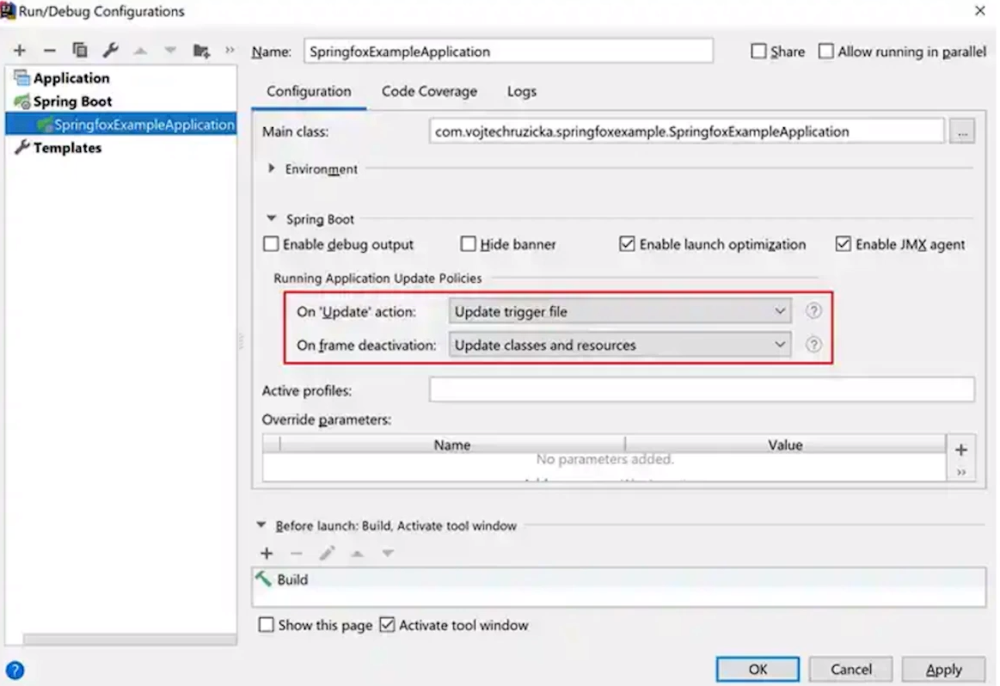

## Настройка spring-boot-devtools

Spring Boot включает в себя дополнительный набор инструментов, которые могут сделать процесс разработки приложений
немного более приятным. Модуль spring-boot-devtools может быть включен в любой проект для обеспечения дополнительных
возможностей во время разработки.

DevTools ускоряет и упрощает разработку приложений Spring Boot, обеспечивая автоматический перезапуск и функцию LiveReload.
В дополнение к этому он устанавливает различные свойства для значений, более подходящих для локальной разработки.
Кроме того, он позволяет вам удаленно подключаться к вашему приложению и при этом использовать большинство его функций.
При запуске приложения в производство DevTools не используются.

```
<dependencies>
    <dependency>
        <groupId>org.springframework.boot</groupId>
        <artifactId>spring-boot-devtools</artifactId>
        <optional>spring-boot-devtools</optional>
    </dependency>
</dependencies>
```
> Зависимость объявлена как необязательная. Это важно, так как такое объявление зависимости предотвращает
транзитивное применение DevTools-зависимости к другим модулям, зависящим от вашего проекта.

Devtools могут вызывать проблемы с загрузкой классов, в частности, в многомодульных проектах. Диагностика проблем с загрузкой классов объясняет, как их диагностировать и решать.

Инструменты разработчика автоматически отключаются при запуске полностью упакованного приложения.
Если ваше приложение запускается из java-jar или если оно запускается из специального загрузчика классов, то оно считается
production-приложением. Вы можете управлять этим поведением с помощью системного свойства spring.devtools.restart.enabled.
Чтобы включить devtools, независимо от загрузчика классов, используемого для запуска вашего приложения, установите системное свойство
Dspring.devtools.restart.enabled=true. Это не должно выполняться в ПРОМ-среде, потому что запуск devtools представляет угрозу безопасности.
Чтобы отключить devtools, исключите зависимость или установите системное свойство Dspring.devtools.restart.enabled=false.

- по умолчанию отключает кеширование (которое может не позволить увеидеть только что внесенные в приложение изменения)
- Позволяет включить уровень логгирования DEBUG для веб-группы ведения журнала (Spring MVC, Spring WebFlux)
- при внесенеии изменений автоматически перезапускает работающее приложение с применением новых изменений, не нужно развертывать приложение вручную

- приложение Spring с использованием DevTools автоматически запускает сервер LiveReload (отслеживает изменения в коде веб-приложения и перегружает страницу в браузере при необходимости)
- DevTools позволяет выполнить горячий перезапуск вашего приложения в той же JVM. Значительным преимуществом горячего перезапуска является то, что он дает JIT
больше возможностей для оптимизации кода, используемого при запуске вашего приложения. После нескольких перезапусков исходное время может сократиться в пять раз.
С ленивой инициализацией мы можем достичь лучших результатов. При установке spring.main.lazy-initialization приложение перезапускается еще быстрее.

## Удаленное подключение (?)

По умолчанию отключено из-за возможных угроз безопасности
```
<build>
    <plugins>
        <plugin>
            <groupId>org.springframework.boot</groupId>
            <artifactId>spring-boot-maven-plugin</artifactId>
            <configuration>
                <excludeDevtools>false</excludeDevtools>
            </configuration>
        </plugin>
    </plugins>
</build>
```
установить пароль, который будет использоваться для аутентификации при подключении к удаленному приложению
```
spring.devtools.remote.secret=somesecret
```

## Отложенная (ленивая) инициализация | Lazy

Когда включена ленивая инициализация, компоненты создаются по мере необходимости,
а не во время запуска приложения.

Преимущества:
- Отложенная инициализация может сократить
время, необходимое для запуска приложения. В веб-приложении компоненты не будут
инициализированы до тех пор, пока не будет получен HTTP-запрос.

Недостатки:
- может задержать обнаружение проблемы с приложением. Если неправильно
настроенный компонет инициализируется лениво, сбой возникнет не во время
старта приложения, а только при инициализации компонента;
- необходимо позаботиться о том, что у JVM хватит памяти для размещения
всех компонентов, а не только для тех, что инициализируются во время запуска.
Перед запуском приложения с ленивой инициализацией необходимо выполнить
точную настройку размера кучи JVM перед включением отложенной инициализации.

Отложенная инициализация может быть включена программно с помощью метода
lazyInitialization() в SpringApplicationBuilder или с помощью метода
setLazyInitialization() в SpringApplication. В качестве альтернативы это
может быть включено с помощью свойства spring.main.lazy-initialization, как
показано в примере ниже.

`spring.main.lazy-initialization=true`

Включение/отключение ленивой инициализации только для определенного компонента
можно с помощью аннотации `@Lazy(true/false)`

## Доступность приложения

При развертывании на некоторых платформах приложения могут предоставлять информацию о своей доступности
платформе. Spring Boot включает в себя готову. поддержку для обычно используемых состояний доступности: liveness и
readiness (при использовании Actuator эти состояния отображаются через специальные эндпоинты):
- **liveness** - указывает, позволяет ли его внутреннее состояние корректно работать или восстанавливаться самостоятельно,
если в данный момент происходит сбой. Нарушенное состояние жизнеспособности означает, что приложение находится в состоянии,
из которого оно не может восстановиться самостоятельно и инфраструктура должна перезапустить приложение. <br><br>
Жизнеспособность не должна основываться на внешних проверках (смежные системы, БД, веб-API) <br><br>
Внутреннее состояние приложений Spring Boot в основном представлено контекстом Spring (экземпляром ApplicationContext).
Если контекст приложения запущен успешно, Spring Boot предполагает, что приложение находится в допустимом состоянии. <br><br>
- **readiness** - указывает, готово ли приложение к обработке трафика. Состояние неготовности сообщает платформе,
что на данный момент ей не следует направлять трафик в приложение (обычно это происходит во время запуска, во время
обработки компонентов `CommandLineRunner` - запускателя командной строи и `ApplicationRunner` - запускателя приложения
или в любое другое время, когда приложение считает, что оно слишкком занято для дополнительного трафика). <br><br>
Приложение считается готовым к трафику, как только были вызваны запускатели приложения и командной строки.

Компоненты приложения могут получать текущее состояние доступности в любое время, внедряя интерфейс `ApplicationAvailability`
и вызывая методы в нем.

```java
@Component
public class MyReadinessStateExporter {
  @EventListener
  public void onStateChange(AvailabilityChangeEvent<ReadinessState> event) {
    switch (event.getState()) {
      case ACCEPTING_TRAFFIC -> {
        // обработка трафика
      }
      case REFUSING_TRAFFIC -> {
        // отказ в обслуживании трафика
      }
    }
  }
}
```

## События приложения и слушатели

Spring Framework представляет несколько событий, которые поогают отслеживать жиненный цикл приложения. Некоторые
из этих событий включают:
- **ContextRefreshedEvent** - событие генерируется, когда контрекст приложения Spring был обновлен (запуск или перезапуск
приложения, добавление новых бинов или изменение настроек во время работы приложения); <br><br>
- **ContextStartedEvent** - генерируется при запуске контекста приложения Spring; <br><br>
- **ContextStoppedEvent** - контекст приложения Spring временно останавливается.
В этом случае приложение не завершается полностью, но его выполнение приостанавливается, и контекст становится недоступен до возобновления работы. <br><br>
Временная остановка контекста приложения Spring может быть связана с возникшей ошибкой или событием,
требующим изменения состояния приложения. В обоих случаях остановка контекста позволяет приложению пересмотреть текущее
состояние и выполнить необходимые действия для восстановления нормальной работы. <br><br>
- **ContextClosedEvent** - Генерируется при полном закрытии контекста приложения Spring.
Когда контекст приложения закрывается, это означает, что приложение завершается полностью, все ресурсы освобождаются,
и работа приложения прекращается.

В дополнение к обычным событиям SpringFramework, Spring Application  отправляет **некоторые дополнительные события приложения**.

Некоторые события фактически запускаются до создания ApplicationContext, поэтому зарегистрировать для них слушатель
как @Bean не получится, они регистрируются либо с помощью `SpringApplication.addListeners(...)`, либо `SpringApplicationBuilder.listeners(...)`.

Обработчик события:
```java
class MyCustomEventListener implements ApplicationListener<ContextRefreshedEvent> {
  @Override
  public void onApplicationEvent(ContextRefreshedEvent event) {
    // обработка события ContextRefreshedEvent
    System.out.println("Received ContextRefreshedEvent");
  }
}
```

Использование метода SpringApplication.addListeners():
```java
@SpringBootApplication
public class AddListenersTest {
  public static void main(String[] args) {
    SpringApplication application = new SpringApplication(AddListenersTest.class);
    application.addListeners(new MyCustomEventListener());
    application.run(args);
  }
}
```
Использование метода SpringApplicationBuilder.listeners():
```java
public class AddListenersTest2 extends SpringBootServletInitializer {
  @Override
  protected SpringApplicationBuilder configure(SpringApplicationBuilder builder) {
    return builder.listeners(new MyCustomEventListener());
  }
}
```

> Слушатели событий не должны запускать потенциально длительные задачи, поскольку по умолчанию они выполняются в одном потоке.

События приложения отправляются в порядке, представленном далее, по мере запуска вашего приложения:

- **ApplicationStartingEvent**: отправляется в начале выполнения, но перед любой обработкой, за исключением регистрации слушателей и инициализаторов. <br><br>
- **ApplicationEnvironmentPreparedEvent**: отправляется, когда известно, что будет использоваться в контексте, но до создания контекста. <br><br>
- **ApplicationContextInitializedEvent**: отправляется, когда ApplicationContext подготовлен и ApplicationContextInitializers были вызваны, но до того, как будут загружены какие-либо определения компонентов. <br><br>
- **ApplicationPreparedEvent**: отправляется непосредственно перед запуском, но после загрузки определений компонентов. <br><br>
- **ApplicationStartedEvent**: сообщение отправляется после обновления контекста, но до того, как будут вызваны какие-либо приложения и исполнители командной строки. <br><br>
- **AvailabilityChangeEvent**: сразу после старта с флагом LivenessState.CORRECT отправляется сообщение, указывающее, что приложение считается запущенным. <br><br>
- **ApplicationReadyEvent**: отправляется после вызова любого приложения и запуска командной строки. <br><br>
- **AvailabilityChangeEvent**: отправляется сообщение с флагом ReadinessState.ACCEPTING_TRAFFIC, указывающее, что приложение готово обслуживать запросы. <br><br>
- **ApplicationFailedEvent**: отправляется, если при запуске возникает исключение.

## Доступ к аргументам приложения любом компоненте

Чтобы получить доступ к аргументам, которые были переданы в SpringApplication.run(...) нужно внедрить компонент
`org.springframework.boot.ApplicationArguments`.

Интерфейс ApplicationArguments предоставляет доступ как к необработанным так и к обработнанным аргументам String[]:
```java
@Component
public class MyBean
{
    public MyBean(ApplicationArguments arguments) {
        boolean debug = arguments.containsOption("debug");
        List<String> files = arguments.getNonOptionArgs();
        if (debug) {
            System.out.println(files);
        }
    }
}
```

## Конфигурация

Классы, которые реализуют автоматическую настройку, снабжены аннотациями **@AutoConfiguration**.

Сама эта аннотация имеет
мета-аннотации @Configuration, что делает автоконфигурации стандартными классами @Configuration.

## Порядок автоконфигураций

Если конфигурацию необходимо применить в определенном порядке, можно использовать атрибуты before, beforeName, after и
afterName в аннотации **@AutoConfiguration** или специальные аннотации **@AutoConfigureBefore** и **@AutoConfigureAfter**.

Например, для конфигурации веб-сайта, возможно, потребуется применить класс после WebMvcAutoConfiguration.

Если есть необходимость подключить определенные автоконфигурации, которые не должны иметь прямого представления друг о друге,
можно использовать аннотацию **@AutoConfigureOrder**. Эта аннотация имеет ту же семантику, что и обычная аннотация **@Order**,
но предоставляет специальный порядок для классов автоматической настройки.

> Как и в случае со стандартными классами @Configuration, порядок, в котором применяются классы автоматической настройки,
> влияет только на порядок определения их компонентов. Порядок, в котором впоследствии создаются эти компоненты, не
> изменяется и определяется зависимостями каждого компонента и любыми отношениями, заданными аннотациями @DependsOn.

## Аннотация @Conditional

В Spring Framework существуют различные виды аннотаций **@Conditional**, которые позволяют управлять конфигурацией приложения
в зависмости от условий. Некоторые из наиболее распространенных видов аннотаций Conditional включают:

### @ConditionalOnClass | @ConditionalOnMissingClass

Позволяет настраивать конфигурацию только в том случае, если определенные классы находятся в classpath.

Существует противоположная аннотация **@ConditionalOnMissingClass**, которая активирует конфигурацию только в том случае,
если указанные классы отсутствуют в classpath.

ASM позволяет использовать атрибут value для ссылки на реальный класс, даже если этот класс может фактически не отображаться в classpath
запущенного приложения.


Также можно использовать атрибут name, если предпочитаете указывать имя класса с помощью значения в типе String.

```java
@AutoConfiguration
// Some conditions…
public class MyAutoconfiguration {
    @Configuration(proxyBeanMethods = false)
    @ConditijnalOnClass(SomeService.class) // или @ConditijnalOnClass(name = "com.bereznev.service.SomeService")
    public static void SomeServiceConfiguration {
    }
}
```

Этот механизм не применяется к методам @Bean, где обычно возвращаемый тип является целью условия: до применения условия
к методу JVM загрузит класс и потенциально обработает ссылки на методы, которые завершатся ошибкой, если класс не присутствует.

Для обработки этого сценария можно использовать отдельный класс @Configuration для изоляции условия, как показано в примере
```java
@AutoConfiguration
// Some conditions…
public class MyAutoconfiguration {

    // Auto-configured beans…

    @Configuration(proxyBeanMethods = false)
    @ConditijnalOnClass(SomeService.class)
    public static class void SomeServiceConfiguration {
	    
        @Bean
    	@ConditionalOnMissingBean
    	public SomeService someService() {
        
            return new SomeService();
    	}
    }
}
```

### ASM и classpath
Метаданные аннотации анализируются с помощью ASM. **ASM** – это универсальная платформа для обработки и анализа байт-кода
Java. Она может использоваться для изменения существующих классов или для динамической генерации классов непосредственно
в двоичной форме.

**Classpath** в Java - это путь или список путей, используемый виртуальной машиной Java (JVM) для поиска байт-кода классов
во время выполнения. Когда JVM загружает класс, он ищет файлы .class в указанных местах classpath.

Classpath может включать директории, в которых расположены скомпилированные классы, а также JAR-файлы, содержащие байт-код
классов. Это позволяет JVM находить и загружать классы, необходимые для выполнения Java-приложения.

Classpath может быть установлен различными способами, такими как через переменные среды, параметры командной строки или
специальные механизмы сборки и запуска Java-приложений.

**Как классы попадают в classpath**:

- **Компиляция**: Классы создаются путем компиляции исходного кода Java (.java файлы) с использованием компилятора Java
(например, javac). Результатом компиляции являются файлы байт-кода Java (.class файлы). <br><br>

- **Стандартная библиотека (JRE)**: Классы из стандартной библиотеки Java (например, java.lang.String) автоматически находятся
в classpath, так как они являются частью среды выполнения Java. <br><br>

- **Директории и JAR-файлы**: После компиляции, скомпилированные классы переносятся в целевую директорию или упаковываются
в JAR-файлы. После этого они могут быть добавлены в classpath. <br><br>

- **Classpath переменная**: При запуске Java-приложения переменная окружения classpath определяет, где JVM будет искать
байт-код классов. Classpath может включать пути к директориям с классами и JAR-файлам. <br><br>

- **Загрузка классов JVM**: JVM (Java Virtual Machine) загружает классы из указанных мест в classpath, делая их доступными
для использования во время выполнения приложения.

### @ConditionalOnBean | @ConditionalOnMissingBean

Аннотации **@ConditionalOnBean** и **@ConditionalOnMissingBean** позволяют включать компонент на основе наличия или отсутствия
конкретных компонентов в ApplicationContext. Атрибут value можно использовать для указания компонентов по типу или name для указания компонентов
по имени. Атрибут search позволяет ограничить иерархию ApplicationContext, которую следует учитывать при поиске компонентов.

Нужно быть очень осторожным с порядком добавления определений компонентов, поскольку эти условия оцениваются на основе того,
что было обработано до момента вычитывания аннотации с этим условием.

При объявлении метода с аннотацией @Bean **нужно указать как можно больше информации о типе в возвращаемом типе метода**.


Например, **если конкретный класс компонента реализует интерфейс, тип возвращаемого метода компонента должен быть конкретным классом, а не интерфейсом**.
Предоставление как можно большего количества информации о типе в методах с аннотацией @Bean особенно важно при использовании
условий компонента, поскольку их оценка может основываться только на информации о типе, которая доступна в сигнатуре метода.

В данном примере бин создастся если нет ни одной импементации интерфейса DemoService. Если есть хотя бы один компонент
любого типа, реализующий DemoService, бин из примера создан не будет
```java
@Bean
@ConditionalOnMissingBean
public DemoService demoService() {
    return new DemoServiceImpl();
}
```

В примере ниже бин будет создат только если контекст не содержит конкретно DemoServiceImpl
```java
@Bean
@ConditionalOnMissingBean
public DemoServiceImpl demoService() {
    return new DemoServiceImpl();
}
```

### @ConditionalOnProperty

Аннотация **@ConditionalOnProperty** позволяет включать конфигурацию на основе свойств Spring. Используйте атрибуты prefix и
name, чтобы указать свойство, которое должно быть проверено. По умолчанию сопоставляется любое свойство, которое существует и не равно false.

```java
@Component
@ConditionalOnProperty(name = "feature.toggle", havingValue = "true")
public class MyConditionalComponent {
   // ...
}
```

В этом примере, компонент MyConditionalComponent будет загружен только если в настройках приложения присутствует свойство feature.toggle=true.

Параметры:
- **name** - имя свойства для проверки его наличия в настройках;
- **prefix** - с какой строки начинается имя свойства;
- **havingValue** - значение, с которым свойство должно соответствовать, чтобы условие было выполнено;
- **matchIfMissing** - логическое значение по умолчанию false, которое определяет, считать ли условие выполненным, если свойство отсутствует в настройках;
Эта аннотация особенно полезна при настройке условной загрузки бинов и компонентов в зависимости от окружения приложения или управления функциональностью с использованием флагов.

### @ConditionalOnResource

Аннотация **@ConditionalOnResource** позволяет включать конфигурацию только при наличии определенного ресурса
(в classpath или файловой системе).
Ресурсы могут быть указаны с использованием обычных соглашений Spring, т. е. это может быть файловый ресурс или
любой другой. Пример ресурса file:/home/user/test.dat.

```java
@Configuration
@ConditionalOnResource(resources = "classpath:config.properties")
public class MyConfiguration {
    // Конфигурация, которая будет активирована только если ресурс config.properties доступен в класспути
}
```

### @ConditionalOnWebApplication | @ConditionalOnNotWebApplication

Аннотация @ConditionalOnWebApplication в Spring Framework позволяет условно загружать бины и конфигурации в зависимости
от того, запущено ли ваше приложение как веб-приложение или нет.

**Веб-приложение на основе сервлетов** – это любое приложение, которое использует Spring **WebApplicationContext**, определяет
область видимости **session** или имеет **ConfigurableWebEnvironment**.

**Реактивное веб-приложение** – это любое приложение, которое использует **ReactiveWebApplicationContext** или имеет **ConfigurableReactiveWebEnvironment**.

### @ConditionalOnWarDeployment | @ConditionalOnNotWarDeployment

Аннотации **@ConditionalOnWarDeployment** и **@ConditionalOnNotWarDeployment** позволяют включать конфигурацию в зависимости
от того, является ли приложение традиционным приложением WAR, развернутым в контейнере сервлета.
Это условие не будет соответствовать приложениям, которые выполняются со встроенным веб-сервером.

### @ConditionalOnExpression

Аннотация **@ConditionalOnExpression** позволяет включать конфигурацию на основе результата выражения SpEL.

>Важно! Ссылка на компонент в выражении приведет к тому, что этот компонент будет инициализирован очень
> рано при обработке обновления контекста. В результате компонент не будет иметь права на последующую обработку
> (например, привязку свойств конфигурации), и его состояние может быть неполным.

```java
@Configuration
@ConditionalOnExpression("${myapp.feature.enabled}")
public class MyConditionalConfiguration {
    // Конфигурация, которая будет активирована только если выражение "${myapp.feature.enabled}" истинно
}
```
В этом примере, MyConditionalConfiguration будет загружен только если условие выражение `${myapp.feature.enabled}` является истинным в контексте SpEL.

Некоторые ключевые моменты использования @ConditionalOnExpression:

Условие должно быть выражено в синтаксисе SpEL.
Можно использовать переменные, бины Spring и другие компоненты для создания более сложных выражений.

# Стартеры Spring Boot

Ключевая идея стартеров Spring Boot состоит в том, чтобы предоставить разработчикам готовые наборы инструментов и библиотек,
чтобы упростить начальную настройку проекта и повысить производительность разработки.

Стартер включает в себя:
- зависимость/совокупность зависимостей;
- автоконфигурация
- дополнительные библеотеки (например, библеотека обработки JSON для веб-стартера)
- инструменты и функциональные возможности, специфичные для определенной цели приложения (например, встроенный Tomcat для веб-стартера).

<br><br>Частоиспользуемые стартеры

| Стартер                      | Описание                                                                                                                                                                  |
|------------------------------|---------------------------------------------------------------------------------------------------------------------------------------------------------------------------|
| spring-boot-starter-web      | Используется для создания веб-приложений, в том числе приложений RESTful с использованием Spring MVC. Он использует Tomcat в качестве встроенного контейнера по умолчанию |
| spring-boot-starter-data-jpa | Используется для подключения Spring Data JPA с Hibernate                                                                                                                  |
| spring-boot-starter-security | Используется для подключения Spring Security для создания безопасных приложений                                                                                           |
| spring-boot-starter-aop      | Используется для аспектно-ориентированного программирования со Spring AOP и AspectJ                                                                                       |
| spring-boot-starter-actuator | Для использования Spring Boot Actuator, предоставляющего готовые функции, которые помогают отслеживать и управлять вашим приложением                                      |

Модуль автоконфигурации стартера в Spring Boot представляет собой набор классов, определяющих конфигурацию для определенной технологической стопки или библиотеки. Этот модуль содержит аннотированные классы, которые автоматически конфигурируют библиотеки и компоненты в вашем приложении, основываясь на наличии определенных зависимостей и настройках.

Когда стартер подключается к проекту, модули автоконфигурации автоматически сканируются и загружаются, что позволяет Spring Boot настраивать приложение в зависимости от обнаруженных модулей и их конфигурационных параметров. Это упрощает процесс настройки приложения и устраняет необходимость явного определения большого количества конфигурационного кода.

Каждый стартер может иметь свой модуль автоконфигурации, что позволяет разработчикам использовать готовую конфигурацию для различных технологий, не тратя время на ее настройку вручную.

# Плагин spring-boot-maven-plugin

Плагин **spring-boot-maven-plugin** представляет собой инструмент для **сборки, запуска и управления приложениями** на
основе Spring Boot с использованием инфраструктуры Maven.

Он не только **обеспечивает возможность простого создания исполняемых JAR-файлов**, включающих все необходимые зависимости,
но также обладает рядом других функций, таких как **упаковка ресурсов, выпуск приложений, запуск прогона интеграционных
тестов, генерация информации о сборке** и т.д.

Кроме того, плагин **позволяет
управлять процессом сборки и запуска** приложения, а также **автоматизировать определенные этапы развертывания**.

Использование плагина **spring-boot-maven-plugin** упрощает процесс сборки, развертывания и управления приложениями Spring Boot,
обеспечивая надежную интеграцию с инструментами сборки Maven.

## Начало работы с плагином spring-boot-maven-plugin

Чтобы использовать плагин Spring Boot Maven, необходимо добавить конфигурацию в раздел plugins вашего pom.xml, как показано в примере:
```
<project>
  <modelVersion>4.0.0</modelVersion>
  <artifactId>getting-started</artifactId>
  <!-- ... -->
  <build>
    <plugins>
      <plugin>
        <groupId>org.springframework.boot</groupId>
        <artifactId>spring-boot-maven-plugin</artifactId>
      </plugin>
    </plugins>
  </build>
</project>
```

Если вы используется сборка milestone или snapshot, необходимо добавить соответствующие pluginRepository элементы,
как показано в следующем примере:
```
<pluginRepositories>
  <pluginRepository>
    <id>spring-snapshots</id>
    <url>https://repo.spring.io/snapshot</url>
  </pluginRepository>
  <pluginRepository>
    <id>spring-milestones</id>
    <url>https://repo.spring.io/milestone</url>
  </pluginRepository>
</pluginRepositories>
```

## Использование плагина | spring-boot-starter-parent

Пользователи Maven могут наследовать свой проект от **spring-boot-starter-parent** проекта, чтобы получить необходимые
значения по умолчанию.

**Spring Boot Starter Parent** - это специальный POM проект, предоставляемый Spring Boot, который можно использовать в качестве родительского проекта для ваших собственных проектов на основе Spring Boot. Он содержит преднастроенные зависимости, плагины и настройки, которые помогают облегчить инициализацию и поддержку проектов на Spring Boot.

**Spring Boot Starter Parent** включает в себя рекомендуемые версии зависимостей, плагинов и настроек, что позволяет упростить
управление версиями и обеспечивает согласованность между различными проектами. Это также упрощает процесс обновления до
новых версий Spring Boot и связанных библиотек.

Родительский проект предоставляет функции, перечисленные ниже:

- Версия Java
- Исходная кодировка UTF-8
- Параметры компилятора
- Раздел управления зависимостями
- Профиль
- Фильтрация ресурсов
- Конфигурация плагина

Чтобы настроить проект как наследник от spring-boot-starter-parent, нужно установить блок parent, как показано в примере:
```
<!-- Inherit defaults from Spring Boot -->
<parent>
  <groupId>org.springframework.boot</groupId>
  <artifactId>spring-boot-starter-parent</artifactId>
  <version>3.1.5</version>
</parent>
```

При этом при ипорте дополнительных дополнительных стартеров номерх их версии можно опустить (подтянется из parent)

Но могут быть **причины, по которым вам не следует наследовать от spring-boot-starter-parent** POM. Возможно, у вас есть свой
собственный корпоративный стандартный родительский элемент, который вам нужно использовать, или вы можете предпочесть явно объявить всю свою конфигурацию Maven.