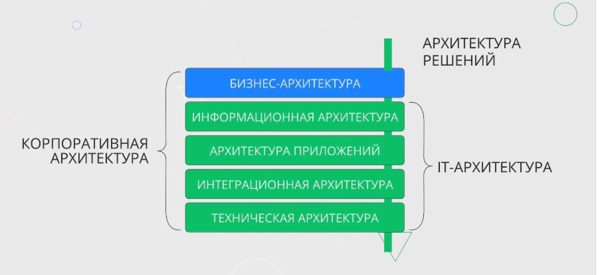

# Слои описания архитектуры

- Бизнес-архитектура - описание предприятия через бизнес-процессы, используемые АС и данные,
которые в них используются
- Информационная архитектура - потоки данных, использующиеся в организациях, процессах,
системах
- Архитектура решений - структура и фунционал приложений, удовлетворяющих потребностям бизнеса
- Интеграционная архитектура - взаимодействие приложений
- Техническая архитектура - инфраструктура и стек для разаботки приложений и развертывания